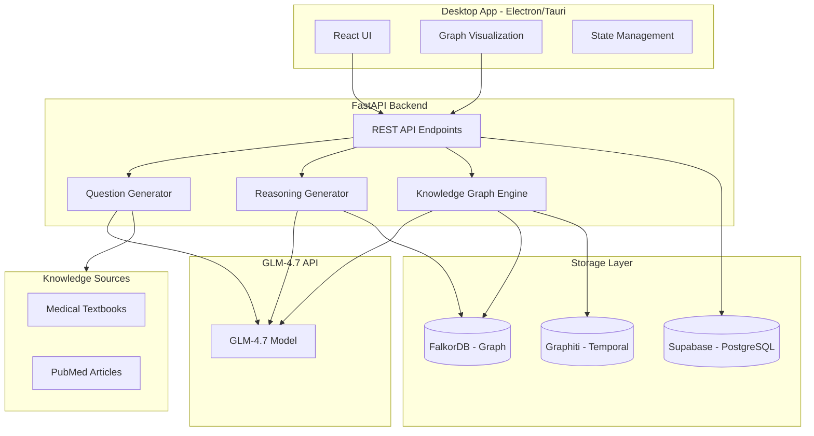

# Medical Genetics MCQ Training App - Architecture Plan

## Project Overview

**Name**: GeneReason (working title)
**Purpose**: AI-powered training application for medical genetics residents to practice complex multiple-choice questions using multiple reasoning strategies
**Target Users**: Medical genetics residents preparing for board certification

### Confirmed Requirements
- **Question Sources**: Thompson & Thompson Genetics in Medicine, plus additional medical genetics textbooks
- **Session Size**: 30 questions per practice session
- **Feedback Timing**: Reasoning shown at end of session (not after each question)

---

## 1. Technology Stack

### Frontend
| Component | Technology | Rationale |
|-----------|------------|-----------|
| Desktop Framework | Electron or Tauri | Cross-platform desktop app |
| UI Framework | React 18+ | Component-based architecture |
| State Management | Zustand or Jotai | Lightweight, minimal boilerplate |
| Graph Visualization | React Flow or Cytoscape.js | Interactive knowledge graph display |
| Styling | TailwindCSS | Rapid UI development |
| Markdown Rendering | React-Markdown | For question stems and explanations |

### Backend
| Component | Technology | Rationale |
|-----------|------------|-----------|
| API Framework | FastAPI | Async Python, OpenAPI docs |
| LLM Integration | GLM-4.7 API | As specified by user |
| Task Queue | Celery or ARQ | Async question generation |
| Graph Processing | NetworkX | Python graph manipulation |

### Databases
| Database | Purpose | Technology |
|----------|---------|------------|
| Primary Data | Users, questions, sessions, progress | Supabase (PostgreSQL) |
| Knowledge Graphs | Dynamic graph storage per question | FalkorDB |
| Temporal Graphs | Learning history, concept evolution | Graphiti |

### Infrastructure
| Component | Technology |
|-----------|------------|
| Containerization | Docker + Docker Compose |
| Local Development | All services in containers |
| API Gateway | Traefik or Nginx (optional) |

---

## 2. System Architecture



---

## 3. Core Modules

### 3.1 Question Generation Module

**Purpose**: Generate board-style MCQs from medical literature

**Components**:
- Document ingestor (PDF, text, web scraping)
- Question template engine
- Distractor generator
- Quality validator

**Process Flow**:
1. Ingest source material (textbook chapter, PubMed article)
2. Extract key concepts via GLM-4.7
3. Generate clinical stem with realistic scenario
4. Create correct answer and 4 distractors
5. Validate question quality and difficulty
6. Store in Supabase

### 3.2 Knowledge Graph Module

**Purpose**: Dynamically generate and visualize concept relationships

**Node Types**:
- **Finding**: Clinical signs, symptoms, lab values
- **Condition**: Genetic disorders, syndromes
- **Gene**: Specific genes involved
- **Mechanism**: Pathophysiological processes
- **Inheritance**: Pattern (AR, AD, X-linked, etc.)
- **Treatment**: Management options
- **Diagnostic**: Tests and procedures

**Edge Types**:
- `HAS_FINDING`: Condition → Finding
- `CAUSED_BY`: Condition → Gene
- `INHERITED_AS`: Condition → Inheritance Pattern
- `TREATED_WITH`: Condition → Treatment
- `DIAGNOSED_BY`: Condition → Diagnostic
- `DIFFERENTIAL_OF`: Condition → Condition
- `CONSTRAINS`: Finding → Condition (negative)

### 3.3 Reasoning Engine Module

**Purpose**: Generate step-by-step reasoning using multiple strategies

**Implemented Strategies**:

#### A. Association/Knowledge Graph Reasoning
```
Input: Clinical stem + Options
Process:
1. Extract entities from stem
2. Build knowledge graph connecting entities
3. For each option, trace graph path from stem entities
4. Score paths by relevance and strength
5. Rank options by path scores
Output: Graph visualization + path explanations
```

#### B. Hypothetico-Deductive Reasoning
```
Input: Clinical stem + Options
Process:
1. Generate initial hypotheses from key findings
2. For each hypothesis, identify discriminating features
3. Match discriminating features to stem evidence
4. Calculate support score for each hypothesis
5. Rank hypotheses by support
Output: Hypothesis list + evidence matching
```

#### C. Constraint Satisfaction Reasoning
```
Input: Clinical stem + Options
Process:
1. Extract constraints from stem (age, sex, findings, etc.)
2. For each option, check constraint violations
3. Eliminate options that violate constraints
4. Rank remaining options by constraint fit
Output: Constraint list + elimination chain
```

#### D. Argument-Based Reasoning
```
Input: Clinical stem + Options
Process:
1. For each option, generate supporting arguments
2. For each option, generate opposing arguments
3. Weigh argument strength
4. Calculate net support score
5. Rank options by net support
Output: Argument map for each option
```

---

## 4. Data Models

### 4.1 Supabase (PostgreSQL) Schema

```sql
-- Users table
CREATE TABLE users (
    id UUID PRIMARY KEY DEFAULT gen_random_uuid(),
    email VARCHAR(255) UNIQUE,
    created_at TIMESTAMP DEFAULT NOW(),
    settings JSONB DEFAULT '{}'
);

-- Questions table
CREATE TABLE questions (
    id UUID PRIMARY KEY DEFAULT gen_random_uuid(),
    stem TEXT NOT NULL,
    options JSONB NOT NULL, -- {A: text, B: text, C: text, D: text, E: text}
    correct_answer CHAR(1) NOT NULL,
    difficulty VARCHAR(20), -- easy, medium, hard
    category VARCHAR(100), -- e.g., Metabolic Disorders, Cancer Genetics
    source_reference TEXT,
    created_at TIMESTAMP DEFAULT NOW()
);

-- Question sessions
CREATE TABLE sessions (
    id UUID PRIMARY KEY DEFAULT gen_random_uuid(),
    user_id UUID REFERENCES users(id),
    question_id UUID REFERENCES questions(id),
    started_at TIMESTAMP DEFAULT NOW(),
    completed_at TIMESTAMP,
    user_answer CHAR(1),
    is_correct BOOLEAN,
    time_spent_seconds INTEGER
);

-- Reasoning traces
CREATE TABLE reasoning_traces (
    id UUID PRIMARY KEY DEFAULT gen_random_uuid(),
    session_id UUID REFERENCES sessions(id),
    strategy VARCHAR(50), -- association, hypothetico-deductive, etc.
    reasoning_steps JSONB,
    graph_data JSONB, -- nodes and edges for visualization
    created_at TIMESTAMP DEFAULT NOW()
);

-- User progress
CREATE TABLE user_progress (
    id UUID PRIMARY KEY DEFAULT gen_random_uuid(),
    user_id UUID REFERENCES users(id),
    category VARCHAR(100),
    total_questions INTEGER DEFAULT 0,
    correct_answers INTEGER DEFAULT 0,
    last_practiced TIMESTAMP,
    UNIQUE(user_id, category)
);
```

### 4.2 FalkorDB Graph Schema

**Node Properties**:
```javascript
// Finding node
{
    id: "uuid",
    type: "finding",
    name: "hepatosplenomegaly",
    category: "physical_exam",
    synonyms: ["enlarged liver and spleen"]
}

// Condition node
{
    id: "uuid",
    type: "condition",
    name: "Gaucher disease",
    omim_id: "230800",
    inheritance: "autosomal_recessive",
    gene: "GBA"
}
```

**Edge Properties**:
```javascript
// HAS_FINDING edge
{
    type: "HAS_FINDING",
    frequency: "common", // common, occasional, rare
    specificity: "high", // high, moderate, low
    source: "textbook_reference"
}
```

---

## 5. API Endpoints

### Question Management
```
POST   /api/questions/generate     # Generate new question from source
GET    /api/questions/{id}         # Get question by ID
GET    /api/questions/random       # Get random question for practice
POST   /api/questions/validate     # Validate question quality
```

### Session Management
```
POST   /api/sessions/start         # Start new practice session
PUT    /api/sessions/{id}/answer   # Submit answer
GET    /api/sessions/{id}/reasoning # Get reasoning for session
POST   /api/sessions/{id}/complete # Complete session
```

### Reasoning
```
POST   /api/reasoning/analyze      # Generate all reasoning strategies
POST   /api/reasoning/graph        # Generate knowledge graph
POST   /api/reasoning/hypotheses   # Generate hypothetico-deductive analysis
POST   /api/reasoning/constraints  # Generate constraint satisfaction
POST   /api/reasoning/arguments    # Generate argument-based analysis
```

### Progress
```
GET    /api/progress/dashboard     # Get user dashboard data
GET    /api/progress/category/{cat} # Get progress by category
```

---

## 6. User Interface Design

### 6.1 Main Practice Screen

```
┌─────────────────────────────────────────────────────────────────────┐
│  GeneReason                              [Progress] [Settings]      │
├─────────────────────────────────────────────────────────────────────┤
│                                                                      │
│  Category: Metabolic Disorders          Difficulty: Medium          │
│  ─────────────────────────────────────────────────────────────────  │
│                                                                      │
│  CLINICAL STEM:                                                      │
│  ┌────────────────────────────────────────────────────────────────┐ │
│  │ A 4-month-old infant presents with failure to thrive,          │ │
│  │ hepatosplenomegaly, and developmental regression. Physical     │ │
│  │ exam reveals cherry-red spot in the macula. Laboratory         │ │
│  │ studies show normal liver enzymes but elevated hexosaminidase  │ │
│  │ A activity is absent in leukocytes.                            │ │
│  └────────────────────────────────────────────────────────────────┘ │
│                                                                      │
│  OPTIONS:                                                            │
│  ○ A) Niemann-Pick disease type A                                   │
│  ○ B) Tay-Sachs disease                                             │
│  ○ C) Gaucher disease type 1                                        │
│  ○ D) Fabry disease                                                 │
│  ○ E) Krabbe disease                                                │
│                                                                      │
│  [Show Hint]  [Build Associations]  [Submit Answer]                 │
│                                                                      │
├─────────────────────────────────────────────────────────────────────┤
│  Timer: 02:34                              Question 5 of 10         │
└─────────────────────────────────────────────────────────────────────┘
```

### 6.2 Knowledge Graph Visualization Screen

```
┌─────────────────────────────────────────────────────────────────────┐
│  Knowledge Graph - Association Reasoning                            │
├─────────────────────────────────────────────────────────────────────┤
│                                                                      │
│         ┌──────────────┐                                            │
│         │ 4-month-old  │                                            │
│         │    infant    │                                            │
│         └──────┬───────┘                                            │
│                │                                                     │
│                ▼                                                     │
│  ┌─────────────────────┐      ┌─────────────────────┐              │
│  │ hepatosplenomegaly  │◄────►│   Tay-Sachs disease │              │
│  └─────────┬───────────┘      └──────────┬──────────┘              │
│            │                             │                          │
│            │ CONFLICTS                   │ SUPPORTS                 │
│            ▼                             ▼                          │
│  ┌─────────────────────┐      ┌─────────────────────┐              │
│  │  cherry-red spot    │◄────►│ absent hex A        │              │
│  └─────────────────────┘      └─────────────────────┘              │
│                                                                      │
│  [Legend]  [Filter]  [Expand]  [Explain Path]                       │
└─────────────────────────────────────────────────────────────────────┘
```

### 6.3 Reasoning Comparison Screen

```
┌─────────────────────────────────────────────────────────────────────┐
│  Multi-Strategy Reasoning Analysis                                  │
├─────────────────────────────────────────────────────────────────────┤
│                                                                      │
│  [Knowledge Graph] [Hypothetico-Deductive] [Constraints] [Arguments]│
│  ═════════════════                                                    │
│                                                                      │
│  CONSTRAINT SATISFACTION ANALYSIS:                                   │
│                                                                      │
│  Constraint 1: Age 4 months                                         │
│    ✓ Tay-Sachs: CONSISTENT (onset 3-6 months)                       │
│    ✓ Niemann-Pick A: CONSISTENT (onset infancy)                     │
│    ✗ Gaucher type 1: INCONSISTENT (typically later onset)           │
│    ✗ Fabry: INCONSISTENT (childhood onset, not infancy)            │
│                                                                      │
│  Constraint 2: Hepatosplenomegaly present                           │
│    ✓ Niemann-Pick A: CONSISTENT (classic finding)                   │
│    ✗ Tay-Sachs: INCONSISTENT (typically absent)                     │
│                                                                      │
│  Constraint 3: Cherry-red spot present                              │
│    ✓ Tay-Sachs: CONSISTENT (classic finding)                        │
│    ✓ Niemann-Pick A: CONSISTENT (can be present)                    │
│                                                                      │
│  Constraint 4: Absent hexosaminidase A                              │
│    ✓ Tay-Sachs: CONSISTENT (definitive test)                        │
│    ✗ Niemann-Pick A: INCONSISTENT (hex A is normal)                 │
│                                                                      │
│  CONCLUSION: Tay-Sachs disease best satisfies all constraints       │
│                                                                      │
└─────────────────────────────────────────────────────────────────────┘
```

### 6.4 Knowledge Graph Visualization - Detailed Design

This section describes how the knowledge graph visualization integrates with each of the four reasoning strategies.

#### Core Graph Visualization Components

**Graph Canvas Features:**
- Interactive pan and zoom
- Node click to expand details
- Edge hover to show relationship type and weight
- Color-coded nodes by type (findings, conditions, genes, mechanisms)
- Animated edge thickness based on relationship strength
- Mini-map for navigation in large graphs

**Node Visual Encoding:**
| Node Type | Shape | Color | Size |
|-----------|-------|-------|------|
| Finding | Circle | Blue | Medium |
| Condition | Rectangle | Red | Large |
| Gene | Diamond | Green | Small |
| Mechanism | Hexagon | Purple | Medium |
| Inheritance | Triangle | Orange | Small |
| Treatment | Rounded Rectangle | Teal | Medium |

**Edge Visual Encoding:**
| Relationship | Line Style | Arrow | Color |
|--------------|------------|-------|-------|
| HAS_FINDING | Solid | Yes | Gray |
| CAUSED_BY | Dashed | Yes | Red |
| CONSTRAINS | Dotted | Yes | Orange |
| DIFFERENTIAL_OF | Double | No | Purple |
| SUPPORTS | Solid | Yes | Green |
| OPPOSES | Dashed | Yes | Red |

---

#### Strategy 1: Association/Knowledge Graph Visualization

**Visual Metaphor**: Constellation map showing how findings connect to conditions

**Graph Structure**:
```
                    ┌─────────────────┐
                    │   4-month-old   │
                    │     infant      │
                    └────────┬────────┘
                             │
              ┌──────────────┼──────────────┐
              │              │              │
              ▼              ▼              ▼
     ┌─────────────┐ ┌─────────────┐ ┌─────────────┐
     │hepatospleno-│ │ cherry-red  │ │  failure to │
     │   megaly    │ │    spot     │ │   thrive    │
     └──────┬──────┘ └──────┬──────┘ └──────┬──────┘
            │               │               │
            │    ┌──────────┴──────────┐    │
            │    │                     │    │
            ▼    ▼                     ▼    ▼
    ┌───────────────────┐      ┌───────────────────┐
    │   Tay-Sachs       │◄────►│   Niemann-Pick    │
    │    disease        │      │    disease A      │
    └─────────┬─────────┘      └───────────────────┘
              │
              │ (strongest path)
              ▼
    ┌───────────────────┐
    │  HEXA gene        │
    │  deficiency       │
    └───────────────────┘
```

**Interactive Features**:
1. **Path Highlighting**: Click any option to highlight the reasoning path from stem findings to that condition
2. **Path Strength Indicator**: Thicker lines = stronger associations; animated pulse shows direction
3. **Conflict Markers**: Red X on edges where findings contradict a condition
4. **Support Score**: Each option displays cumulative path strength score

**User Interaction Flow**:
1. User sees full graph with all findings and all candidate conditions
2. User clicks Option A (Tay-Sachs) → Graph highlights paths connecting stem findings to Tay-Sachs
3. User clicks Option B (Niemann-Pick) → Graph shows different paths, highlights conflicts
4. User compares visual path strength between options
5. At session end, correct answer path is shown with explanation annotations

**Visual Indicators for Discrimination**:
- Green glow on nodes/findings that SUPPORT an option
- Red glow on nodes/findings that OPPOSE an option
- Yellow highlight on nodes/findings that are NEUTRAL
- Gray fade on nodes not relevant to selected option

---

#### Strategy 2: Hypothetico-Deductive Visualization

**Visual Metaphor**: Hypothesis testing tree with evidence branches

**Graph Structure**:
```
                         ┌─────────────────────────┐
                         │   KEY STEM FINDINGS     │
                         │ • 4-month-old infant    │
                         │ • Hepatosplenomegaly    │
                         │ • Cherry-red spot       │
                         │ • Absent hex A          │
                         └───────────┬─────────────┘
                                     │
              ┌──────────────────────┼──────────────────────┐
              │                      │                      │
              ▼                      ▼                      ▼
    ┌─────────────────┐    ┌─────────────────┐    ┌─────────────────┐
    │  HYPOTHESIS 1   │    │  HYPOTHESIS 2   │    │  HYPOTHESIS 3   │
    │   Tay-Sachs     │    │  Niemann-Pick   │    │    Gaucher      │
    └────────┬────────┘    └────────┬────────┘    └────────┬────────┘
             │                      │                      │
    ┌────────┴────────┐    ┌────────┴────────┐    ┌────────┴────────┐
    │ DISCRIMINATING  │    │ DISCRIMINATING  │    │ DISCRIMINATING  │
    │    FEATURES     │    │    FEATURES     │    │    FEATURES     │
    │ • Hex A level   │    │ • Organomegaly  │    │ • Age at onset  │
    │ • Organ size    │    │ • Neurodegen    │    │ • Bone lesions  │
    │ • Neurodegen    │    │ • Hex A level   │    │ • Organomegaly  │
    └────────┬────────┘    └────────┬────────┘    └────────┬────────┘
             │                      │                      │
             ▼                      ▼                      ▼
    ┌─────────────────┐    ┌─────────────────┐    ┌─────────────────┐
    │ EVIDENCE MATCH  │    │ EVIDENCE MATCH  │    │ EVIDENCE MATCH  │
    │   ████████░░ 8  │    │   ██████░░░░ 6  │    │   ████░░░░░░ 4  │
    │   SUPPORTED     │    │   PARTIAL       │    │   CONFLICTS     │
    └─────────────────┘    └─────────────────┘    └─────────────────┘
```

**Interactive Features**:
1. **Hypothesis Cards**: Each hypothesis displayed as expandable card
2. **Evidence Matching**: Animated checkmarks/crosses appear as evidence is matched
3. **Discriminating Feature List**: Side panel shows which features best discriminate
4. **Support Bar**: Visual progress bar showing evidence strength per hypothesis

**User Interaction Flow**:
1. Graph shows all hypotheses generated from key findings
2. User clicks a hypothesis → Discriminating features list expands
3. Each feature shows match/mismatch with stem evidence
4. Support score updates dynamically
5. At session end, shows which hypothesis had best evidence match

**Visual Indicators**:
- Green checkmark: Feature present in stem, supports hypothesis
- Red X: Feature absent/contradictory in stem
- Yellow question mark: Feature not mentioned, indeterminate
- Blue info icon: Feature is discriminating (differentiates hypotheses)

---

#### Strategy 3: Constraint Satisfaction Visualization

**Visual Metaphor**: Funnel/filter showing progressive elimination

**Graph Structure**:
```
┌─────────────────────────────────────────────────────────────────────────┐
│                        ALL CANDIDATE OPTIONS                            │
│  ┌─────────┐ ┌─────────┐ ┌─────────┐ ┌─────────┐ ┌─────────┐           │
│  │Tay-Sachs│ │Niemann- │ │ Gaucher │ │ Fabry   │ │ Krabbe  │           │
│  │         │ │  Pick   │ │         │ │         │ │         │           │
│  └────┬────┘ └────┬────┘ └────┬────┘ └────┬────┘ └────┬────┘           │
└───────┼───────────┼───────────┼───────────┼───────────┼─────────────────┘
        │           │           │           │           │
        ▼           ▼           ▼           ▼           ▼
┌─────────────────────────────────────────────────────────────────────────┐
│  CONSTRAINT 1: Age of onset 3-6 months                                 │
│  ┌─────────┐ ┌─────────┐ ┌─────────┐ ┌─────────┐ ┌─────────┐           │
│  │    ✓    │ │    ✓    │ │    ✗    │ │    ✗    │ │    ✓    │           │
│  │Tay-Sachs│ │Niemann- │ │ Gaucher │ │ Fabry   │ │ Krabbe  │           │
│  │  KEEP   │ │  PICK   │ │ELIMINATE│ │ELIMINATE│ │  KEEP   │           │
│  └─────────┘ └─────────┘ └─────────┘ └─────────┘ └─────────┘           │
└─────────────────────────────────────────────────────────────────────────┘
        │           │                       │           │
        ▼           ▼                       ▼           ▼
┌─────────────────────────────────────────────────────────────────────────┐
│  CONSTRAINT 2: Hepatosplenomegaly present                               │
│  ┌─────────┐ ┌─────────┐               ┌─────────┐                     │
│  │    ✗    │ │    ✓    │               │    ✓    │                     │
│  │Tay-Sachs│ │Niemann- │               │ Krabbe  │                     │
│  │CONFLICT │ │  PICK   │               │  KEEP   │                     │
│  └─────────┘ └─────────┘               └─────────┘                     │
└─────────────────────────────────────────────────────────────────────────┘
        │           │                       │
        ▼           ▼                       ▼
┌─────────────────────────────────────────────────────────────────────────┐
│  CONSTRAINT 3: Cherry-red spot present                                  │
│  ┌─────────┐ ┌─────────┐               ┌─────────┐                     │
│  │    ✓    │ │    ✓    │               │    ✗    │                     │
│  │Tay-Sachs│ │Niemann- │               │ Krabbe  │                     │
│  │  KEEP   │ │  PICK   │               │ELIMINATE│                     │
│  └─────────┘ └─────────┘               └─────────┘                     │
└─────────────────────────────────────────────────────────────────────────┘
        │           │
        ▼           ▼
┌─────────────────────────────────────────────────────────────────────────┐
│  CONSTRAINT 4: Absent hexosaminidase A (DEFINITIVE)                     │
│  ┌─────────┐ ┌─────────┐                                               │
│  │    ✓    │ │    ✗    │                                               │
│  │Tay-Sachs│ │Niemann- │                                               │
│  │  BEST   │ │ELIMINATE│                                               │
│  │  MATCH  │ │         │                                               │
│  └─────────┘ └─────────┘                                               │
└─────────────────────────────────────────────────────────────────────────┘
        │
        ▼
┌─────────────────────────────────────────────────────────────────────────┐
│                    ★ TAY-SACHS DISEASE ★                               │
│                    Best satisfies all constraints                       │
└─────────────────────────────────────────────────────────────────────────┘
```

**Interactive Features**:
1. **Constraint Funnel**: Animated funnel showing options being filtered
2. **Constraint Cards**: Each constraint displayed as a filter stage
3. **Elimination Animation**: Options fade out with red X when eliminated
4. **Conflict Highlight**: Yellow warning for partial conflicts (not definitive)
5. **Final Candidate Glow**: Remaining options highlighted at each stage

**User Interaction Flow**:
1. All options shown at top of funnel
2. User clicks through constraints sequentially
3. At each constraint, options are checked and eliminated/kept
4. Animation shows options dropping out
5. At session end, shows complete elimination chain with explanations

**Visual Indicators**:
- Green border + checkmark: Constraint satisfied
- Red border + X: Constraint violated, option eliminated
- Yellow border + !: Partial conflict, not definitive
- Gray/faded: Already eliminated by previous constraint
- Gold glow: Final remaining candidate

---

#### Strategy 4: Argument-Based Visualization

**Visual Metaphor**: Scales of justice / debate format showing pro-con arguments

**Graph Structure**:
```
┌─────────────────────────────────────────────────────────────────────────┐
│                        ARGUMENT MAP                                      │
│                     Option A: Tay-Sachs Disease                         │
├─────────────────────────────────────────────────────────────────────────┤
│                                                                          │
│   SUPPORTING ARGUMENTS              OPPOSING ARGUMENTS                  │
│   (PROS)                            (CONS)                              │
│   ┌─────────────────────┐          ┌─────────────────────┐             │
│   │ ✓ Cherry-red spot   │          │ ✗ Hepatospleno-     │             │
│   │   is classic finding│          │   megaly is rare    │             │
│   │   in Tay-Sachs      │          │   in Tay-Sachs      │             │
│   │   Weight: STRONG    │          │   Weight: MODERATE  │             │
│   └─────────────────────┘          └─────────────────────┘             │
│   ┌─────────────────────┐          ┌─────────────────────┐             │
│   │ ✓ Absent hex A is   │          │                     │             │
│   │   DIAGNOSTIC for    │          │    (no other        │             │
│   │   Tay-Sachs         │          │     opposing args)  │             │
│   │   Weight: DEFINITIVE│          │                     │             │
│   └─────────────────────┘          └─────────────────────┘             │
│   ┌─────────────────────┐                                                │
│   │ ✓ Age 4 months fits │          NET SCORE: +2.5                     │
│   │   typical onset     │          ████████████████░░░░ STRONGLY       │
│   │   Weight: MODERATE  │          SUPPORTED                           │
│   └─────────────────────┘                                                │
│                                                                          │
├─────────────────────────────────────────────────────────────────────────┤
│                     Option B: Niemann-Pick Disease A                    │
├─────────────────────────────────────────────────────────────────────────┤
│                                                                          │
│   SUPPORTING ARGUMENTS              OPPOSING ARGUMENTS                  │
│   (PROS)                            (CONS)                              │
│   ┌─────────────────────┐          ┌─────────────────────┐             │
│   │ ✓ Hepatospleno-     │          │ ✗ Hex A is NORMAL   │             │
│   │   megaly is classic │          │   in Niemann-Pick   │             │
│   │   in N-P type A     │          │   Weight: DEFINITIVE│             │
│   │   Weight: STRONG    │          └─────────────────────┘             │
│   └─────────────────────┘                                                │
│   ┌─────────────────────┐          NET SCORE: -1.5                     │
│   │ ✓ Cherry-red spot   │          ████████░░░░░░░░░░░░ WEAKLY         │
│   │   can be present    │          OPPOSED                             │
│   │   Weight: MODERATE  │                                                │
│   └─────────────────────┘                                                │
│                                                                          │
└─────────────────────────────────────────────────────────────────────────┘
```

**Interactive Features**:
1. **Argument Cards**: Each pro/con displayed as draggable card
2. **Weight Sliders**: Visual indicator of argument strength (weak/moderate/strong/definitive)
3. **Balance Scale**: Animated scale showing net support for each option
4. **Comparison Mode**: Side-by-side view of all options ranked by net score
5. **Click to Expand**: Click any argument to see detailed explanation with citations

**User Interaction Flow**:
1. User selects an option to view its argument map
2. Pro arguments listed on left, con arguments on right
3. Each argument shows weight and evidence from stem
4. Net score calculated and displayed
5. User can toggle between options to compare argument strength
6. At session end, shows all options ranked by argument strength

**Visual Indicators**:
- Green card with thumbs up: Supporting argument
- Red card with thumbs down: Opposing argument
- Weight badges: WEAKEST → WEAK → MODERATE → STRONG → DEFINITIVE
- Score bar: Red (opposed) ←→ Yellow (neutral) ←→ Green (supported)
- Crown icon: Option with highest net score

---

#### Unified Session Review Screen

At the end of a 30-question session, the user sees a comprehensive review:

```
┌─────────────────────────────────────────────────────────────────────────┐
│  SESSION REVIEW - Question 15 of 30                                     │
│  ═══════════════════════════════════════════════════════════════════    │
│                                                                          │
│  Your Answer: B (Niemann-Pick)    ✗ INCORRECT                          │
│  Correct Answer: A (Tay-Sachs)                                          │
│                                                                          │
│  ┌──────────────────────────────────────────────────────────────────┐   │
│  │ [Association] [Hypothetico] [Constraints] [Arguments]            │   │
│  │ ═════════════                                                     │   │
│  │                                                                   │   │
│  │  (Interactive graph visualization for selected strategy)          │   │
│  │                                                                   │   │
│  │  Each tab shows the same question analyzed through                │   │
│  │  a different reasoning lens                                       │   │
│  │                                                                   │   │
│  └──────────────────────────────────────────────────────────────────┘   │
│                                                                          │
│  KEY LEARNING POINTS:                                                    │
│  • Hexosaminidase A deficiency is DIAGNOSTIC for Tay-Sachs             │
│  • Hepatosplenomegaly is more typical of Niemann-Pick than Tay-Sachs   │
│  • Both conditions can present with cherry-red spot                     │
│                                                                          │
│  [Previous Question]    [Next Question]    [End Review]                 │
└─────────────────────────────────────────────────────────────────────────┘
```

---

## 7. GLM-4.7 Integration

### 7.1 Prompt Templates

#### Question Generation Prompt
```
You are an expert medical genetics educator creating board-style 
multiple-choice questions for medical genetics residents.

SOURCE MATERIAL:
{source_text}

Generate a clinical vignette-style multiple-choice question with:
1. A realistic clinical stem (3-5 sentences)
2. Five answer options (A-E)
3. One clearly correct answer
4. Four plausible distractors that test discrimination ability
5. Difficulty level: {difficulty}
6. Focus area: {category}

Format your response as JSON:
{
  "stem": "...",
  "options": {"A": "...", "B": "...", "C": "...", "D": "...", "E": "..."},
  "correct_answer": "A",
  "explanation": "...",
  "key_concepts": ["concept1", "concept2", ...]
}
```

#### Knowledge Graph Generation Prompt
```
Analyze this clinical vignette and extract entities and relationships 
for a medical knowledge graph.

CLINICAL STEM:
{stem}

OPTIONS:
{options}

Extract:
1. All clinical findings (symptoms, signs, lab values)
2. All mentioned or implied conditions
3. Relevant genes and mechanisms
4. Relationships between entities

Format as JSON:
{
  "nodes": [
    {"id": "1", "type": "finding", "name": "..."},
    ...
  ],
  "edges": [
    {"source": "1", "target": "2", "relationship": "HAS_FINDING", "weight": 0.9},
    ...
  ]
}
```

#### Reasoning Generation Prompt
```
Generate step-by-step reasoning to answer this medical genetics question.

STEM: {stem}
OPTIONS: {options}

Using {strategy} reasoning, explain why the correct answer is best.

For ASSOCIATION reasoning:
- Build semantic connections from stem findings to each option
- Identify which option has strongest association network

For HYPOTHETICO-DEDUCTIVE reasoning:
- Generate 3-5 initial hypotheses from key findings
- Identify discriminating features for each hypothesis
- Match evidence to support/eliminate hypotheses

For CONSTRAINT SATISFACTION reasoning:
- Extract explicit and implicit constraints from stem
- Apply each constraint to eliminate options
- Show elimination chain

For ARGUMENT-BASED reasoning:
- For each option, list supporting arguments
- For each option, list opposing arguments
- Weigh and compare argument strength

Format response as structured JSON with reasoning steps.
```

### 7.2 API Integration

```python
# Example structure (not implementation code)
class GLMService:
    def __init__(self, api_key: str):
        self.api_key = api_key
        self.base_url = "https://open.bigmodel.cn/api/paas/v4"
    
    async def generate_question(self, source: str, category: str) -> dict:
        # Call GLM-4.7 with question generation prompt
        pass
    
    async def generate_knowledge_graph(self, stem: str, options: list) -> dict:
        # Call GLM-4.7 with graph extraction prompt
        pass
    
    async def generate_reasoning(self, stem: str, options: list, strategy: str) -> dict:
        # Call GLM-4.7 with reasoning prompt
        pass
```

---

## 8. Docker Configuration

### docker-compose.yml Structure
```yaml
version: '3.8'

services:
  frontend:
    build: ./frontend
    ports:
      - "3000:3000"
    environment:
      - API_URL=http://backend:8000
    depends_on:
      - backend

  backend:
    build: ./backend
    ports:
      - "8000:8000"
    environment:
      - DATABASE_URL=${SUPABASE_URL}
      - FALKORDB_URL=falkordb:6379
      - GLM_API_KEY=${GLM_API_KEY}
    depends_on:
      - falkordb

  falkordb:
    image: falkordb/falkordb:latest
    ports:
      - "6379:6379"
    volumes:
      - falkordb_data:/data

volumes:
  falkordb_data:
```

---

## 9. Development Phases

### Phase 1: Foundation
- [x] Set up project structure and Docker environment
- [x] Implement basic FastAPI backend
- [x] Set up Supabase connection and schema
- [x] Set up FalkorDB connection
- [x] Implement GLM-4.7 API integration

### Phase 2: Question Generation
- [x] Build document ingestion pipeline
- [x] Implement question generation with GLM-4.7
- [x] Create question storage and retrieval
- [x] Build basic practice interface

### Phase 3: Knowledge Graph
- [x] Implement graph extraction from questions
- [x] Store graphs in FalkorDB
- [x] Build graph visualization component
- [x] Implement association-based reasoning

### Phase 4: Multi-Strategy Reasoning
- [x] Implement hypothetico-deductive reasoning
- [x] Implement constraint satisfaction reasoning
- [x] Implement argument-based reasoning
- [x] Build reasoning comparison UI

### Phase 5: Polish and Integration
- [x] Add progress tracking
- [ ] Implement Graphiti for temporal graphs
- [x] Add user settings and preferences
- [x] Add spaced repetition system (SRS)
- [x] Add bookmarking functionality
- [x] Add study plans feature
- [ ] Performance optimization
- [x] Testing and refinement (in progress)

---

## 10. Key Design Decisions

| Decision | Choice | Rationale |
|----------|--------|-----------|
| Dynamic vs Pre-built Graphs | Dynamic via LLM | Flexibility, no need for comprehensive ontology maintenance |
| Graph Database | FalkorDB | Native graph queries, Redis-compatible, good Python support |
| Multiple Reasoning Strategies | 4 strategies | Develops well-rounded clinical reasoning skills |
| Desktop vs Web | Desktop | Offline capability, personal use, simpler deployment |
| LLM | GLM-4.7 | User preference, strong multilingual support |

---

## 11. Open Questions for User

1. **Question Sources**: Which specific textbooks or resources should be used for question generation? (e.g., Thompson & Thompson Genetics, Emery's Elements of Medical Genetics)

2. **Difficulty Calibration**: How should question difficulty be determined and adjusted?

3. **Session Structure**: How many questions per practice session? Timed vs untimed?

4. **Feedback Timing**: Should reasoning be shown after each question or at end of session?

5. **Progress Metrics**: What analytics are most important? (accuracy by category, improvement over time, time per question)

---

*Architecture Plan v1.0 - Medical Genetics MCQ Training App*
