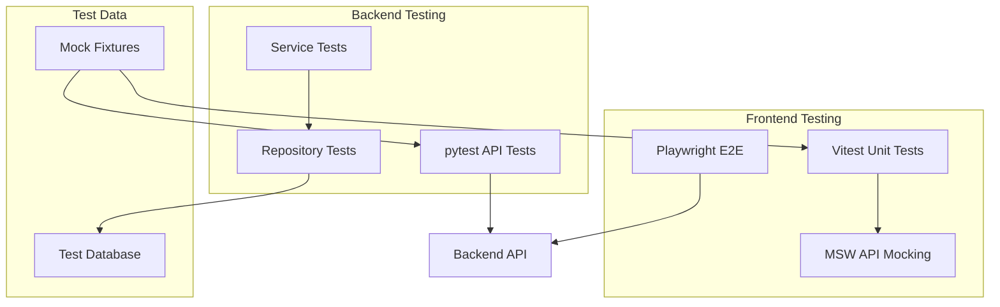

# Phase 13: End-to-End Testing Plan

## Overview

This phase adds comprehensive testing infrastructure for the GeneReason application, covering frontend unit tests, end-to-end tests, and backend API tests.

## Testing Stack

### Frontend Testing

| Tool | Purpose | Version |
|------|---------|---------|
| Vitest | Unit/component test runner | Latest |
| @testing-library/react | React component testing | Latest |
| @testing-library/user-event | User interaction simulation | Latest |
| jsdom | DOM environment for tests | Latest |
| Playwright | E2E browser testing | Latest |
| @axe-core/playwright | Accessibility testing | Latest |
| msw | API mocking | Latest |

### Backend Testing

| Tool | Purpose | Version |
|------|---------|---------|
| pytest | Test framework | Latest |
| pytest-asyncio | Async test support | Latest |
| httpx | Test client for FastAPI | Already installed |
| pytest-cov | Coverage reporting | Latest |
| faker | Generate test data | Latest |

---

## Test File Structure

```
frontend/
├── src/
│   ├── __tests__/
│   │   ├── setup.ts                    # Vitest setup file
│   │   └── mocks/
│   │       ├── handlers.ts             # MSW request handlers
│   │       └── server.ts               # MSW server setup
│   ├── components/
│   │   ├── common/
│   │   │   ├── Button.test.tsx
│   │   │   ├── Card.test.tsx
│   │   │   ├── Modal.test.tsx
│   │   │   ├── OptionButton.test.tsx
│   │   │   ├── ProgressBar.test.tsx
│   │   │   └── KeyboardHint.test.tsx
│   │   ├── question/
│   │   │   ├── QuestionDisplay.test.tsx
│   │   │   └── OptionSelector.test.tsx
│   │   ├── reasoning/
│   │   │   ├── ReasoningViewer.test.tsx
│   │   │   ├── AssociationView.test.tsx
│   │   │   ├── HypotheticoView.test.tsx
│   │   │   ├── ConstraintsView.test.tsx
│   │   │   └── ArgumentsView.test.tsx
│   │   └── layout/
│   │       ├── Header.test.tsx
│   │       ├── Sidebar.test.tsx
│   │       └── Layout.test.tsx
│   ├── stores/
│   │   ├── questionStore.test.ts
│   │   └── sessionStore.test.ts
│   ├── hooks/
│   │   └── useKeyboard.test.ts
│   └── pages/
│       ├── Dashboard.test.tsx
│       ├── PracticeSession.test.tsx
│       └── SessionReview.test.tsx
├── e2e/
│   ├── playwright.config.ts
│   ├── global-setup.ts
│   ├── global-teardown.ts
│   ├── fixtures/
│   │   └── test-fixtures.ts
│   ├── tests/
│   │   ├── auth.spec.ts
│   │   ├── dashboard.spec.ts
│   │   ├── practice-session.spec.ts
│   │   ├── reasoning.spec.ts
│   │   ├── session-review.spec.ts
│   │   ├── keyboard-navigation.spec.ts
│   │   └── accessibility.spec.ts
│   └── page-objects/
│       ├── DashboardPage.ts
│       ├── PracticeSessionPage.ts
│       └── SessionReviewPage.ts
└── vitest.config.ts

backend/
├── tests/
│   ├── __init__.py
│   ├── conftest.py                       # Shared fixtures
│   ├── test_api/
│   │   ├── __init__.py
│   │   ├── test_questions.py
│   │   ├── test_sessions.py
│   │   ├── test_reasoning.py
│   │   ├── test_progress.py
│   │   ├── test_graph.py
│   │   ├── test_llm.py
│   │   └── test_auth.py
│   ├── test_services/
│   │   ├── __init__.py
│   │   ├── test_question_repository.py
│   │   ├── test_session_repository.py
│   │   ├── test_progress_repository.py
│   │   ├── test_graph_service.py
│   │   └── test_llm_service.py
│   ├── test_models/
│   │   ├── __init__.py
│   │   ├── test_question_model.py
│   │   ├── test_session_model.py
│   │   └── test_graph_model.py
│   └── fixtures/
│       ├── questions.json
│       ├── sessions.json
│       └── graphs.json
└── pytest.ini
```

---

## Test Categories

### 1. Frontend Unit Tests (Vitest)

#### Component Tests
- **Common Components**: Button, Card, Modal, OptionButton, ProgressBar, KeyboardHint
- **Question Components**: QuestionDisplay, OptionSelector
- **Reasoning Components**: ReasoningViewer, AssociationView, HypotheticoView, ConstraintsView, ArgumentsView
- **Layout Components**: Header, Sidebar, Layout

#### Store Tests
- **questionStore**: Load questions, filtering, random selection, category management
- **sessionStore**: Session lifecycle, answer submission, timer, progress tracking

#### Hook Tests
- **useKeyboard**: Keyboard shortcuts, event handling, cleanup

### 2. Frontend E2E Tests (Playwright)

#### User Flows
1. **Dashboard Flow**
   - Load dashboard
   - View statistics
   - Navigate to practice session

2. **Practice Session Flow**
   - Start new session with category selection
   - Answer questions
   - Navigate between questions
   - Complete session
   - View results

3. **Session Review Flow**
   - Access completed session
   - Review each question
   - View reasoning strategies
   - Compare answers

4. **Keyboard Navigation**
   - Navigate with arrow keys
   - Select options with number keys
   - Submit with Enter
   - Cancel with Escape

5. **Accessibility Tests**
   - WCAG 2.1 AA compliance
   - Screen reader compatibility
   - Keyboard-only navigation

### 3. Backend API Tests (pytest)

#### API Endpoint Tests
- **Questions API**: CRUD operations, filtering, random selection
- **Sessions API**: Create, update, complete, review
- **Reasoning API**: Generate reasoning, all strategies
- **Progress API**: Dashboard data, history, categories
- **Graph API**: Nodes, edges, associations, status
- **LLM API**: Generate question, reasoning, explanation
- **Auth API**: Login, register, token validation

#### Service Tests
- **Repositories**: Data access with mock and real databases
- **Services**: Business logic, error handling
- **External integrations**: LLM, graph database

---

## Test Data Strategy

### Mock Data
- Use existing mock data from `frontend/src/mock/` and `backend/app/mock/`
- Create additional test-specific fixtures for edge cases

### MSW (Mock Service Worker)
- Intercept API calls in frontend tests
- Provide consistent responses
- Simulate error conditions

### Test Fixtures
- Sample questions covering all categories and difficulties
- Sample sessions with various states
- Sample graphs with different node/edge configurations

---

## Coverage Goals

| Area | Target Coverage |
|------|-----------------|
| Frontend Components | 80% |
| Frontend Stores | 90% |
| Frontend Hooks | 90% |
| Backend API Routes | 85% |
| Backend Services | 80% |
| E2E Critical Paths | 100% |

---

## Implementation Steps

### Step 1: Frontend Testing Infrastructure
- [ ] Install Vitest and testing dependencies
- [ ] Configure Vitest for React/TypeScript
- [ ] Set up testing-library utilities
- [ ] Configure MSW for API mocking
- [ ] Create test setup files

### Step 2: Frontend Unit Tests
- [ ] Write tests for common components
- [ ] Write tests for question components
- [ ] Write tests for reasoning components
- [ ] Write tests for layout components
- [ ] Write tests for Zustand stores
- [ ] Write tests for custom hooks

### Step 3: Playwright E2E Setup
- [ ] Install Playwright
- [ ] Configure Playwright for the project
- [ ] Create page object models
- [ ] Set up test fixtures
- [ ] Configure global setup/teardown

### Step 4: E2E Test Suites
- [ ] Write dashboard flow tests
- [ ] Write practice session flow tests
- [ ] Write session review flow tests
- [ ] Write keyboard navigation tests
- [ ] Write accessibility tests

### Step 5: Backend Testing Infrastructure
- [ ] Install pytest and dependencies
- [ ] Configure pytest for async tests
- [ ] Create shared fixtures
- [ ] Set up test database handling

### Step 6: Backend Unit Tests
- [ ] Write tests for API routes
- [ ] Write tests for services
- [ ] Write tests for repositories
- [ ] Write tests for models

### Step 7: CI/CD Integration
- [ ] Add test scripts to package.json
- [ ] Configure coverage reporting
- [ ] Set up GitHub Actions workflow
- [ ] Add test badges to README

---

## Test Commands

### Frontend
```bash
# Run unit tests
npm run test

# Run tests with coverage
npm run test:coverage

# Run tests in watch mode
npm run test:watch

# Run E2E tests
npm run test:e2e

# Run E2E tests in UI mode
npm run test:e2e:ui
```

### Backend
```bash
# Run all tests
pytest

# Run with coverage
pytest --cov=app --cov-report=html

# Run specific test file
pytest tests/test_api/test_questions.py

# Run tests in watch mode
pytest-watch
```

---

## Dependencies to Add

### Frontend (package.json)
```json
{
  "devDependencies": {
    "vitest": "^1.0.0",
    "@vitest/ui": "^1.0.0",
    "@testing-library/react": "^14.0.0",
    "@testing-library/user-event": "^14.0.0",
    "@testing-library/jest-dom": "^6.0.0",
    "jsdom": "^24.0.0",
    "msw": "^2.0.0",
    "@playwright/test": "^1.40.0",
    "@axe-core/playwright": "^4.8.0"
  }
}
```

### Backend (requirements.txt)
```
pytest>=7.0.0
pytest-asyncio>=0.21.0
pytest-cov>=4.0.0
pytest-watch>=4.2.0
faker>=20.0.0
```

---

## Mermaid Diagram: Test Architecture



---

## Success Criteria

1. All unit tests pass consistently
2. E2E tests cover all critical user flows
3. Backend API tests achieve 85%+ coverage
4. Accessibility tests pass WCAG 2.1 AA
5. Tests run in CI/CD pipeline
6. Test execution time under 5 minutes for unit tests
7. E2E tests complete within 10 minutes

---

*Phase 13 Testing Plan - GeneReason Medical Genetics MCQ Training App*
