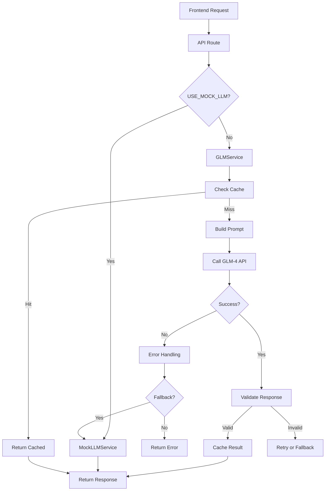

# Phase 15: Real LLM Integration Plan

## Overview

This phase integrates the real GLM-4 API (zhipuai/bigmodel) for question and reasoning generation, replacing the mock LLM service.

## Current Status

- ✅ GLMService implementation exists in [`backend/app/services/llm_service.py`](backend/app/services/llm_service.py)
- ✅ API URL configured: `https://open.bigmodel.cn/api/paas/v4`
- ✅ API Key obtained: `2732c537cde742508ef6972b332028d4.oLx5WmPPIFqI10yH`
- ✅ Configuration in [`backend/app/core/config.py`](backend/app/core/config.py)
- ⏳ Need to update `.env` and test connectivity

## Implementation Steps

### Step 1: Update Environment Configuration

Update [`backend/.env`](backend/.env):
```env
LLM_API_KEY=2732c537cde742508ef6972b332028d4.oLx5WmPPIFqI10yH
USE_MOCK_LLM=false
```

### Step 2: Test API Connectivity

Create a test script to verify GLM-4 API connection works correctly.

### Step 3: Enhance Prompt Templates

The existing prompts in [`GLMService`](backend/app/services/llm_service.py:276) need refinement:

#### Question Generation Prompt
- Add medical genetics domain expertise
- Include difficulty calibration
- Ensure clinical vignette quality
- Add validation for generated content

#### Reasoning Generation Prompts
Four strategies need specialized prompts:

1. **Association/Graph-Based** - Map findings to conditions
2. **Hypothetico-Deductive** - Form and test hypotheses
3. **Constraint Satisfaction** - Eliminate options systematically
4. **Argument-Based** - Build comparative arguments

### Step 4: Add Response Validation

Create validation layer for:
- JSON structure validation
- Medical content accuracy checks
- Option plausibility verification
- Fallback to mock on failure

### Step 5: Implement Caching

Add caching for:
- Generated questions (by category/difficulty)
- Reasoning results (by question + strategy)
- Rate limit tracking

### Step 6: Error Handling

Implement robust error handling:
- API timeout handling
- Rate limit compliance
- Graceful fallback to mock
- User-friendly error messages

## Architecture



## API Endpoints to Test

| Endpoint | Method | Description |
|----------|--------|-------------|
| `/api/llm/generate-question` | POST | Generate new MCQ |
| `/api/llm/generate-reasoning` | POST | Generate reasoning |
| `/api/llm/generate-explanation` | POST | Generate explanation |
| `/api/llm/status` | GET | Check LLM status |
| `/api/llm/strategies` | GET | List strategies |

## Testing Checklist

- [ ] API connectivity test
- [ ] Question generation test (each difficulty)
- [ ] Reasoning generation test (each strategy)
- [ ] Explanation generation test
- [ ] Error handling test
- [ ] Rate limit test
- [ ] Fallback test

## Files to Modify

1. [`backend/.env`](backend/.env) - Add API key, disable mock
2. [`backend/app/services/llm_service.py`](backend/app/services/llm_service.py) - Enhance prompts, add caching
3. [`backend/app/api/routes/llm.py`](backend/app/api/routes/llm.py) - Verify endpoints
4. [`backend/tests/test_services/test_llm.py`](backend/tests/test_services/test_llm.py) - Add integration tests

## Security Notes

- API key stored in `.env` (not committed to git)
- `.env.example` updated with placeholder
- Rate limiting prevents API abuse
- Fallback ensures service continuity
