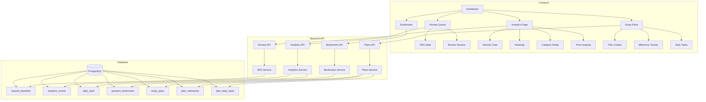

# Phase 19: Advanced Learning Features

## Overview

Phase 19 introduces advanced learning features to enhance the educational value of GeneReason. These features focus on:
1. **Spaced Repetition System (SRS)** - Optimize long-term retention
2. **Enhanced Analytics Dashboard** - Deep insights into learning patterns
3. **Question Bookmarking & Notes** - Personal study aids
4. **Custom Study Plans** - Personalized learning paths

---

## Feature 1: Spaced Repetition System (SRS)

### Overview
Implement a scientifically-backed spaced repetition algorithm to optimize review scheduling based on individual performance.

### Algorithm Choice: SM-2 Variant
The SM-2 algorithm (used by Anki) is well-suited for MCQ practice:
- Items have difficulty ratings
- Interval calculation based on performance
- Easy to implement and understand

### Database Schema Changes

```sql
-- Spaced repetition data for each user-question pair
CREATE TABLE IF NOT EXISTS spaced_repetition (
    id UUID PRIMARY KEY DEFAULT uuid_generate_v4(),
    user_id UUID NOT NULL REFERENCES users(id) ON DELETE CASCADE,
    question_id UUID NOT NULL REFERENCES questions(id) ON DELETE CASCADE,
    -- SM-2 Algorithm fields
    ease_factor DECIMAL(3,2) DEFAULT 2.50,  -- Difficulty multiplier
    interval_days INTEGER DEFAULT 0,         -- Days until next review
    repetitions INTEGER DEFAULT 0,           -- Consecutive correct recalls
    next_review_date DATE NOT NULL,          -- Scheduled review date
    last_review_date DATE,                   -- Last time reviewed
    -- Performance tracking
    total_reviews INTEGER DEFAULT 0,
    total_correct INTEGER DEFAULT 0,
    -- Metadata
    created_at TIMESTAMP WITH TIME ZONE DEFAULT NOW(),
    updated_at TIMESTAMP WITH TIME ZONE DEFAULT NOW(),
    UNIQUE(user_id, question_id)
);

CREATE INDEX idx_spaced_repetition_user ON spaced_repetition(user_id);
CREATE INDEX idx_spaced_repetition_next_review ON spaced_repetition(next_review_date);
CREATE INDEX idx_spaced_repetition_user_next ON spaced_repetition(user_id, next_review_date);
```

### API Endpoints

```
GET    /api/v1/review/due              # Get questions due for review today
GET    /api/v1/review/upcoming         # Get upcoming review schedule
POST   /api/v1/review/submit           # Submit review result (updates SRS)
GET    /api/v1/review/stats            # Get SRS statistics
POST   /api/v1/review/preview          # Preview next intervals for a question
```

### Frontend Components

1. **ReviewQueue Page** - Daily review session
   - Shows questions due for review
   - Prioritizes by urgency (overdue first)
   - Quick practice mode

2. **ReviewSchedule Component** - Calendar view
   - Visualize upcoming reviews
   - Forecast workload

3. **SRSStats Component** - Statistics widget
   - Cards due today/tomorrow/week
   - Retention rate
   - Forecast chart

### SM-2 Algorithm Implementation

```python
def calculate_next_review(
    current_ease: float,
    current_interval: int,
    repetitions: int,
    quality: int  # 0-5, where 5 = perfect, 0 = complete failure
) -> tuple[float, int, int]:
    """
    SM-2 algorithm variant for MCQ practice.
    
    Quality mapping for MCQ:
    - 5: Correct answer, high confidence, quick response
    - 4: Correct answer, some hesitation
    - 3: Correct answer, low confidence or took hints
    - 2: Incorrect answer, but close
    - 1: Incorrect answer, no idea
    - 0: Complete failure / did not attempt
    
    Returns: (new_ease, new_interval, new_repetitions)
    """
    if quality >= 3:
        # Successful recall
        if repetitions == 0:
            new_interval = 1
        elif repetitions == 1:
            new_interval = 6
        else:
            new_interval = round(current_interval * current_ease)
        
        new_repetitions = repetitions + 1
        new_ease = current_ease + (0.1 - (5 - quality) * (0.08 + (5 - quality) * 0.02))
    else:
        # Failed recall - reset
        new_interval = 1
        new_repetitions = 0
        new_ease = max(1.3, current_ease - 0.2)
    
    return max(1.3, new_ease), new_interval, new_repetitions
```

---

## Feature 2: Enhanced Analytics Dashboard

### Overview
Transform the current basic dashboard into a comprehensive learning analytics center.

### New Components

#### 2.1 Learning Velocity Chart
- Questions per day/week/month
- Trend analysis
- Goal tracking

#### 2.2 Accuracy Heatmap
- Calendar heatmap showing daily accuracy
- Visual patterns of performance
- Streak visualization

#### 2.3 Category Deep Dive
- Radar chart for category proficiency
- Strengths and weaknesses identification
- Recommended focus areas

#### 2.4 Time Analysis
- Average time per question
- Time-of-day performance correlation
- Session duration trends

#### 2.5 Learning Predictions
- Projected exam readiness
- Estimated mastery dates per category
- Recommended study hours

### Database Schema Changes

```sql
-- Detailed analytics events for rich insights
CREATE TABLE IF NOT EXISTS analytics_events (
    id UUID PRIMARY KEY DEFAULT uuid_generate_v4(),
    user_id UUID NOT NULL REFERENCES users(id) ON DELETE CASCADE,
    event_type VARCHAR(50) NOT NULL,  -- question_answered, session_completed, etc.
    event_data JSONB NOT NULL,
    created_at TIMESTAMP WITH TIME ZONE DEFAULT NOW()
);

CREATE INDEX idx_analytics_events_user ON analytics_events(user_id);
CREATE INDEX idx_analytics_events_type ON analytics_events(event_type);
CREATE INDEX idx_analytics_events_created ON analytics_events(created_at);

-- Pre-computed daily stats for fast dashboard loading
CREATE TABLE IF NOT EXISTS daily_stats (
    id UUID PRIMARY KEY DEFAULT uuid_generate_v4(),
    user_id UUID NOT NULL REFERENCES users(id) ON DELETE CASCADE,
    date DATE NOT NULL,
    questions_answered INTEGER DEFAULT 0,
    correct_answers INTEGER DEFAULT 0,
    time_spent_seconds INTEGER DEFAULT 0,
    sessions_completed INTEGER DEFAULT 0,
    categories_practiced TEXT[],
    UNIQUE(user_id, date)
);

CREATE INDEX idx_daily_stats_user_date ON daily_stats(user_id, date);
```

### API Endpoints

```
GET    /api/v1/analytics/velocity       # Learning velocity data
GET    /api/v1/analytics/heatmap        # Accuracy heatmap data
GET    /api/v1/analytics/categories     # Category performance deep dive
GET    /api/v1/analytics/time           # Time analysis data
GET    /api/v1/analytics/predictions    # Learning predictions
GET    /api/v1/analytics/export         # Export user data as CSV/JSON
```

### Frontend Components

1. **AnalyticsPage** - New dedicated analytics page
2. **VelocityChart** - Line/area chart component
3. **AccuracyHeatmap** - Calendar heatmap (like GitHub contributions)
4. **CategoryRadarChart** - Radar/spider chart for categories
5. **TimeAnalysisChart** - Bar/line charts for time metrics
6. **PredictionCard** - AI-powered predictions display

---

## Feature 3: Question Bookmarking & Notes

### Overview
Allow users to save questions for later review and add personal notes.

### Database Schema Changes

```sql
-- User bookmarks for questions
CREATE TABLE IF NOT EXISTS question_bookmarks (
    id UUID PRIMARY KEY DEFAULT uuid_generate_v4(),
    user_id UUID NOT NULL REFERENCES users(id) ON DELETE CASCADE,
    question_id UUID NOT NULL REFERENCES questions(id) ON DELETE CASCADE,
    note TEXT,                           -- User's personal note
    tags TEXT[],                         -- User-defined tags
    created_at TIMESTAMP WITH TIME ZONE DEFAULT NOW(),
    updated_at TIMESTAMP WITH TIME ZONE DEFAULT NOW(),
    UNIQUE(user_id, question_id)
);

CREATE INDEX idx_bookmarks_user ON question_bookmarks(user_id);
CREATE INDEX idx_bookmarks_tags ON question_bookmarks USING GIN(tags);
```

### API Endpoints

```
GET    /api/v1/bookmarks                     # List all bookmarks
POST   /api/v1/bookmarks                     # Create bookmark
DELETE /api/v1/bookmarks/{question_id}       # Remove bookmark
PUT    /api/v1/bookmarks/{question_id}       # Update bookmark note/tags
GET    /api/v1/bookmarks/tags                # List user's bookmark tags
GET    /api/v1/bookmarks/search              # Search bookmarks by tag/note
```

### Frontend Components

1. **BookmarkButton** - Toggle bookmark on question
2. **BookmarkList Page** - View all bookmarked questions
3. **NoteEditor** - Rich text editor for notes
4. **TagInput** - Tag management component

---

## Feature 4: Custom Study Plans

### Overview
Allow users to create personalized study plans with goals and milestones.

### Database Schema Changes

```sql
-- Study plans
CREATE TABLE IF NOT EXISTS study_plans (
    id UUID PRIMARY KEY DEFAULT uuid_generate_v4(),
    user_id UUID NOT NULL REFERENCES users(id) ON DELETE CASCADE,
    name VARCHAR(200) NOT NULL,
    description TEXT,
    target_date DATE,                    -- Goal completion date
    status VARCHAR(20) DEFAULT 'active' CHECK (status IN ('active', 'completed', 'paused')),
    settings JSONB DEFAULT '{}'::jsonb,  -- Daily goals, category focus, etc.
    created_at TIMESTAMP WITH TIME ZONE DEFAULT NOW(),
    updated_at TIMESTAMP WITH TIME ZONE DEFAULT NOW()
);

-- Plan milestones
CREATE TABLE IF NOT EXISTS plan_milestones (
    id UUID PRIMARY KEY DEFAULT uuid_generate_v4(),
    plan_id UUID NOT NULL REFERENCES study_plans(id) ON DELETE CASCADE,
    title VARCHAR(200) NOT NULL,
    description TEXT,
    target_date DATE,
    completed_at TIMESTAMP WITH TIME ZONE,
    order_index INTEGER NOT NULL,
    created_at TIMESTAMP WITH TIME ZONE DEFAULT NOW()
);

-- Daily plan tasks
CREATE TABLE IF NOT EXISTS plan_daily_tasks (
    id UUID PRIMARY KEY DEFAULT uuid_generate_v4(),
    plan_id UUID NOT NULL REFERENCES study_plans(id) ON DELETE CASCADE,
    date DATE NOT NULL,
    task_type VARCHAR(50) NOT NULL,      -- practice_questions, review_bookmarks, etc.
    target_count INTEGER,                 -- Number of questions, etc.
    completed_count INTEGER DEFAULT 0,
    status VARCHAR(20) DEFAULT 'pending' CHECK (status IN ('pending', 'completed', 'skipped')),
    created_at TIMESTAMP WITH TIME ZONE DEFAULT NOW(),
    UNIQUE(plan_id, date, task_type)
);

CREATE INDEX idx_study_plans_user ON study_plans(user_id);
CREATE INDEX idx_milestones_plan ON plan_milestones(plan_id);
CREATE INDEX idx_daily_tasks_plan_date ON plan_daily_tasks(plan_id, date);
```

### API Endpoints

```
# Study Plans
GET    /api/v1/plans                          # List user's plans
POST   /api/v1/plans                          # Create new plan
GET    /api/v1/plans/{id}                     # Get plan details
PUT    /api/v1/plans/{id}                     # Update plan
DELETE /api/v1/plans/{id}                     # Delete plan

# Milestones
GET    /api/v1/plans/{id}/milestones          # List milestones
POST   /api/v1/plans/{id}/milestones          # Add milestone
PUT    /api/v1/milestones/{id}                # Update milestone
DELETE /api/v1/milestones/{id}                # Delete milestone
POST   /api/v1/milestones/{id}/complete       # Mark milestone complete

# Daily Tasks
GET    /api/v1/plans/{id}/tasks/today         # Get today's tasks
GET    /api/v1/plans/{id}/tasks/week          # Get week's tasks
POST   /api/v1/tasks/{id}/complete            # Mark task complete

# Plan Generation
POST   /api/v1/plans/generate                 # AI-generate a study plan
```

### Frontend Components

1. **StudyPlanPage** - Main plan management page
2. **PlanCreator** - Wizard for creating new plans
3. **PlanDashboard** - Active plan overview
4. **MilestoneTracker** - Progress through milestones
5. **DailyTaskList** - Today's tasks component
6. **PlanProgress** - Visual progress indicator

---

## Implementation Order

### Sub-phase 19.1: Spaced Repetition System
- Database schema migration
- Backend SRS service and API
- Frontend ReviewQueue page
- Integration with existing session flow

### Sub-phase 19.2: Question Bookmarking
- Database schema migration
- Backend bookmark API
- Frontend bookmark components
- Bookmark list page

### Sub-phase 19.3: Enhanced Analytics
- Database schema migration
- Analytics aggregation service
- New analytics API endpoints
- Analytics dashboard page
- Chart components

### Sub-phase 19.4: Custom Study Plans
- Database schema migration
- Plan management API
- Plan creation wizard
- Daily task system
- AI plan generation

---

## Architecture Diagram



---

## Testing Strategy

### Unit Tests
- SRS algorithm calculations
- Analytics aggregations
- Plan scheduling logic

### Integration Tests
- API endpoints for each feature
- Database operations
- Service interactions

### E2E Tests
- Complete review session flow
- Bookmark creation and retrieval
- Study plan creation and progress
- Analytics data visualization

---

## Migration Strategy

1. **Backward Compatibility**: All new tables are additive; no changes to existing schema
2. **Data Migration**: Existing session data can be used to seed initial SRS data
3. **Feature Flags**: Each sub-phase can be toggled independently
4. **Rollout**: Gradual rollout per sub-phase

---

## Success Metrics

| Feature | Metric | Target |
|---------|--------|--------|
| SRS | Daily active reviewers | 60% of users |
| SRS | 30-day retention rate | 75% |
| Analytics | Dashboard engagement | 80% view weekly |
| Bookmarks | Questions bookmarked | 30% of questions |
| Study Plans | Users with active plans | 40% |
| Study Plans | Plan completion rate | 50% |

---

*Phase 19 Plan v1.0 - GeneReason Advanced Learning Features*
