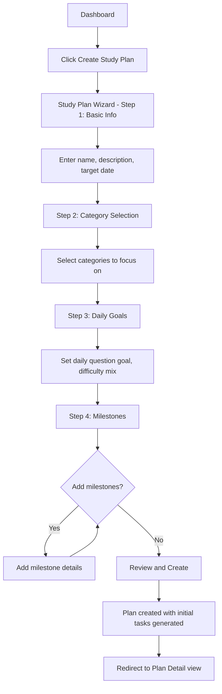
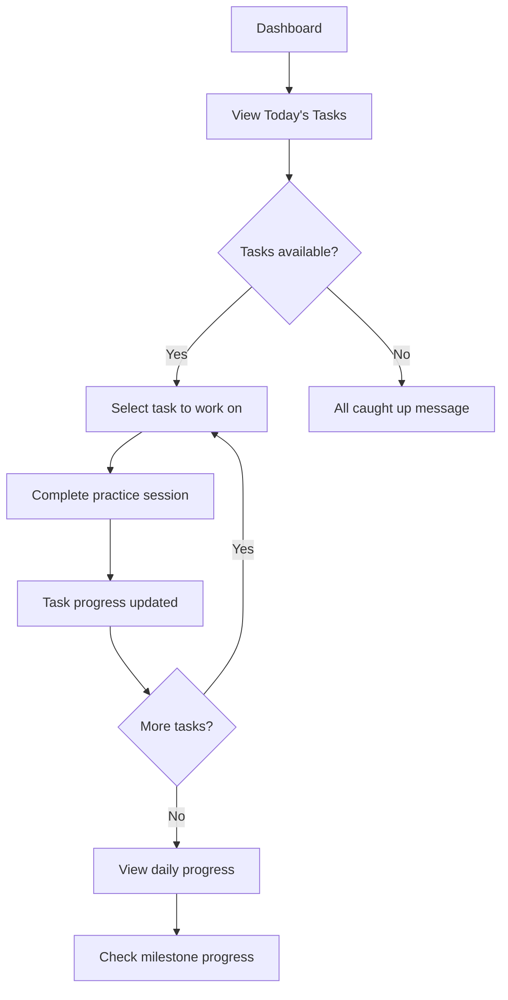
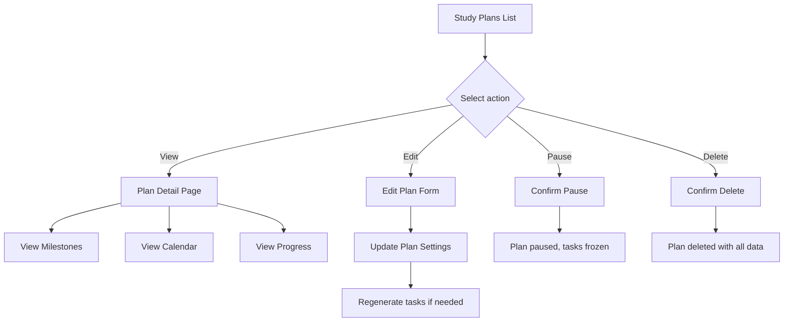

# Phase 20: Custom Study Plans - Implementation Plan

## Overview

Build a comprehensive study plan system that allows users to create personalized learning paths with milestones and daily tasks. This feature leverages the existing database schema (`study_plans`, `plan_milestones`, `plan_daily_tasks`) and integrates with the existing practice session and spaced repetition systems.

## Goals

1. Enable users to create structured study plans with specific goals and timelines
2. Break down plans into trackable milestones
3. Generate daily tasks automatically based on plan settings
4. Track progress and provide visual feedback
5. Integrate with existing practice sessions and review queue

---

## Architecture

### Database Schema (Already Exists)

```sql
-- study_plans: Main plan table
CREATE TABLE study_plans (
    id UUID PRIMARY KEY,
    user_id UUID REFERENCES users(id),
    name VARCHAR(200) NOT NULL,
    description TEXT,
    target_date DATE,
    status VARCHAR(20) DEFAULT 'active',  -- active, completed, paused
    settings JSONB DEFAULT '{}',           -- daily goals, category focus, etc.
    created_at TIMESTAMP WITH TIME ZONE,
    updated_at TIMESTAMP WITH TIME ZONE
);

-- plan_milestones: Plan checkpoints
CREATE TABLE plan_milestones (
    id UUID PRIMARY KEY,
    plan_id UUID REFERENCES study_plans(id),
    title VARCHAR(200) NOT NULL,
    description TEXT,
    target_date DATE,
    completed_at TIMESTAMP WITH TIME ZONE,
    order_index INTEGER NOT NULL,
    created_at TIMESTAMP WITH TIME ZONE
);

-- plan_daily_tasks: Daily generated tasks
CREATE TABLE plan_daily_tasks (
    id UUID PRIMARY KEY,
    plan_id UUID REFERENCES study_plans(id),
    date DATE NOT NULL,
    task_type VARCHAR(50) NOT NULL,        -- practice_questions, review_bookmarks, etc.
    target_count INTEGER,
    completed_count INTEGER DEFAULT 0,
    status VARCHAR(20) DEFAULT 'pending',  -- pending, completed, skipped
    created_at TIMESTAMP WITH TIME ZONE,
    UNIQUE(plan_id, date, task_type)
);
```

### API Endpoints

```
# Study Plans CRUD
GET    /api/v1/study-plans                    # List user's study plans
POST   /api/v1/study-plans                    # Create new study plan
GET    /api/v1/study-plans/{id}               # Get study plan details
PUT    /api/v1/study-plans/{id}               # Update study plan
DELETE /api/v1/study-plans/{id}               # Delete study plan
PUT    /api/v1/study-plans/{id}/status        # Update plan status (pause/resume/complete)

# Milestones
GET    /api/v1/study-plans/{id}/milestones    # Get plan milestones
POST   /api/v1/study-plans/{id}/milestones    # Add milestone
PUT    /api/v1/study-plans/{id}/milestones/{mid}  # Update milestone
DELETE /api/v1/study-plans/{id}/milestones/{mid}  # Delete milestone
PUT    /api/v1/study-plans/{id}/milestones/{mid}/complete  # Mark milestone complete

# Daily Tasks
GET    /api/v1/study-plans/{id}/tasks         # Get plan tasks (with date filter)
GET    /api/v1/study-plans/tasks/today        # Get today's tasks across all plans
PUT    /api/v1/study-plans/{id}/tasks/{tid}   # Update task progress
POST   /api/v1/study-plans/{id}/tasks/generate # Generate tasks for date range

# Progress & Analytics
GET    /api/v1/study-plans/{id}/progress      # Get plan progress summary
GET    /api/v1/study-plans/{id}/calendar      # Get calendar view data
```

---

## Component Structure

### Frontend Components

```
frontend/src/
├── components/
│   └── study-plan/
│       ├── index.ts                    # Exports
│       ├── StudyPlanList.tsx           # List of all plans
│       ├── StudyPlanCard.tsx           # Individual plan card
│       ├── StudyPlanCreate.tsx         # Plan creation wizard
│       ├── StudyPlanDetail.tsx         # Plan detail view
│       ├── StudyPlanForm.tsx           # Plan edit form
│       ├── MilestoneTracker.tsx        # Milestone progress display
│       ├── MilestoneForm.tsx           # Add/edit milestone
│       ├── DailyTaskList.tsx           # Today's tasks view
│       ├── TaskProgress.tsx            # Individual task progress
│       ├── PlanCalendar.tsx            # Calendar view of tasks
│       └── PlanProgress.tsx            # Overall progress visualization
├── pages/
│   └── StudyPlans.tsx                  # Study plans page
├── services/
│   └── studyPlanService.ts             # API service
├── stores/
│   └── studyPlanStore.ts               # Zustand store
└── types/
    └── studyPlan.ts                    # TypeScript types
```

### Backend Structure

```
backend/app/
├── models/
│   └── study_plan.py                   # Pydantic models
├── services/
│   └── study_plan_repository.py        # Data access layer
└── api/routes/
    └── study_plans.py                  # API endpoints
```

---

## Data Models

### Backend Pydantic Models

```python
# study_plan.py

from pydantic import BaseModel, Field
from typing import Optional, List, Dict, Any
from datetime import date, datetime
from enum import Enum

class PlanStatus(str, Enum):
    ACTIVE = "active"
    PAUSED = "paused"
    COMPLETED = "completed"

class TaskType(str, Enum):
    PRACTICE_QUESTIONS = "practice_questions"
    REVIEW_BOOKMARKS = "review_bookmarks"
    REVIEW_SRS = "review_srs"
    STUDY_CATEGORY = "study_category"

class TaskStatus(str, Enum):
    PENDING = "pending"
    COMPLETED = "completed"
    SKIPPED = "skipped"

# Milestone models
class MilestoneCreate(BaseModel):
    title: str = Field(..., max_length=200)
    description: Optional[str] = None
    target_date: Optional[date] = None
    order_index: int

class MilestoneUpdate(BaseModel):
    title: Optional[str] = None
    description: Optional[str] = None
    target_date: Optional[date] = None

class Milestone(MilestoneCreate):
    id: str
    plan_id: str
    completed_at: Optional[datetime] = None
    created_at: datetime

# Daily Task models
class DailyTaskCreate(BaseModel):
    date: date
    task_type: TaskType
    target_count: Optional[int] = None

class DailyTaskUpdate(BaseModel):
    completed_count: Optional[int] = None
    status: Optional[TaskStatus] = None

class DailyTask(DailyTaskCreate):
    id: str
    plan_id: str
    completed_count: int = 0
    status: TaskStatus = TaskStatus.PENDING
    created_at: datetime

# Study Plan models
class StudyPlanSettings(BaseModel):
    daily_question_goal: int = Field(default=10, ge=1, le=100)
    categories: List[str] = Field(default_factory=list)
    difficulty_mix: Dict[str, float] = Field(default={"easy": 0.2, "medium": 0.5, "hard": 0.3})
    include_srs_reviews: bool = True
    include_bookmark_reviews: bool = True
    reminder_time: Optional[str] = None  # HH:MM format
    study_days: List[int] = Field(default=[1, 2, 3, 4, 5, 6, 7])  # 1=Monday, 7=Sunday

class StudyPlanCreate(BaseModel):
    name: str = Field(..., max_length=200)
    description: Optional[str] = None
    target_date: Optional[date] = None
    settings: StudyPlanSettings = Field(default_factory=StudyPlanSettings)
    milestones: List[MilestoneCreate] = Field(default_factory=list)

class StudyPlanUpdate(BaseModel):
    name: Optional[str] = None
    description: Optional[str] = None
    target_date: Optional[date] = None
    settings: Optional[StudyPlanSettings] = None
    status: Optional[PlanStatus] = None

class StudyPlan(BaseModel):
    id: str
    user_id: str
    name: str
    description: Optional[str]
    target_date: Optional[date]
    status: PlanStatus = PlanStatus.ACTIVE
    settings: StudyPlanSettings
    milestones: List[Milestone] = Field(default_factory=list)
    created_at: datetime
    updated_at: datetime

class StudyPlanProgress(BaseModel):
    plan_id: str
    total_milestones: int
    completed_milestones: int
    total_tasks: int
    completed_tasks: int
    current_streak: int
    overall_progress: float  # 0-100 percentage
    days_remaining: Optional[int]
    estimated_completion: Optional[date]
```

### Frontend TypeScript Types

```typescript
// types/studyPlan.ts

export type PlanStatus = 'active' | 'paused' | 'completed';
export type TaskType = 'practice_questions' | 'review_bookmarks' | 'review_srs' | 'study_category';
export type TaskStatus = 'pending' | 'completed' | 'skipped';

export interface StudyPlanSettings {
  daily_question_goal: number;
  categories: string[];
  difficulty_mix: Record<string, number>;
  include_srs_reviews: boolean;
  include_bookmark_reviews: boolean;
  reminder_time?: string;
  study_days: number[];
}

export interface Milestone {
  id: string;
  plan_id: string;
  title: string;
  description?: string;
  target_date?: string;
  completed_at?: string;
  order_index: number;
  created_at: string;
}

export interface DailyTask {
  id: string;
  plan_id: string;
  date: string;
  task_type: TaskType;
  target_count?: number;
  completed_count: number;
  status: TaskStatus;
  created_at: string;
}

export interface StudyPlan {
  id: string;
  user_id: string;
  name: string;
  description?: string;
  target_date?: string;
  status: PlanStatus;
  settings: StudyPlanSettings;
  milestones: Milestone[];
  created_at: string;
  updated_at: string;
}

export interface StudyPlanProgress {
  plan_id: string;
  total_milestones: number;
  completed_milestones: number;
  total_tasks: number;
  completed_tasks: number;
  current_streak: number;
  overall_progress: number;
  days_remaining?: number;
  estimated_completion?: string;
}

export interface CreateStudyPlanRequest {
  name: string;
  description?: string;
  target_date?: string;
  settings?: Partial<StudyPlanSettings>;
  milestones?: Array<{
    title: string;
    description?: string;
    target_date?: string;
    order_index: number;
  }>;
}

export interface UpdateStudyPlanRequest {
  name?: string;
  description?: string;
  target_date?: string;
  settings?: Partial<StudyPlanSettings>;
  status?: PlanStatus;
}
```

---

## User Flows

### 1. Create Study Plan Flow



### 2. Daily Study Flow



### 3. Plan Management Flow



---

## UI Wireframes

### Study Plans List Page

```
┌─────────────────────────────────────────────────────────────────┐
│ Study Plans                                    [+ Create Plan] │
├─────────────────────────────────────────────────────────────────┤
│                                                                 │
│ ┌─────────────────────────────────────────────────────────────┐ │
│ │ 📚 Board Exam Preparation                        ▶ Active   │ │
│ │ Target: March 15, 2026                                      │ │
│ │ Progress: ████████░░░░░░░░ 65%    |    3/5 milestones      │ │
│ │ Today: 8/10 questions completed                             │ │
│ └─────────────────────────────────────────────────────────────┘ │
│                                                                 │
│ ┌─────────────────────────────────────────────────────────────┐ │
│ │ 📖 Lysosomal Disorders Deep Dive                 ⏸ Paused  │ │
│ │ Target: February 28, 2026                                   │ │
│ │ Progress: ████░░░░░░░░░░░░ 30%    |    1/3 milestones      │ │
│ └─────────────────────────────────────────────────────────────┘ │
│                                                                 │
│ ┌─────────────────────────────────────────────────────────────┐ │
│ │ ✅ Quick Review Session                       ✓ Completed   │ │
│ │ Completed: January 15, 2026                                 │ │
│ │ Final Score: 85% accuracy                                   │ │
│ └─────────────────────────────────────────────────────────────┘ │
│                                                                 │
└─────────────────────────────────────────────────────────────────┘
```

### Plan Detail Page

```
┌─────────────────────────────────────────────────────────────────┐
│ ← Back to Plans                                                 │
├─────────────────────────────────────────────────────────────────┤
│                                                                 │
│ Board Exam Preparation                        [Edit] [Pause]   │
│ Prepare for genetics board certification exam                   │
│ Target: March 15, 2026 (32 days remaining)                     │
│                                                                 │
│ ┌─────────────────────────────────────────────────────────────┐ │
│ │ Progress Overview                                           │ │
│ │ ████████████████░░░░ 65% Complete                          │ │
│ │                                                             │ │
│ │ Milestones: 3/5  |  Tasks: 156/240  |  Streak: 7 days     │ │
│ └─────────────────────────────────────────────────────────────┘ │
│                                                                 │
│ ┌───────────────────────┐  ┌───────────────────────────────────┐│
│ │ Today's Tasks         │  │ Milestones                        ││
│ │                       │  │                                   ││
│ │ ☑ Practice 10 Qs (8)  │  │ ✓ Complete basic review           ││
│ │ ☐ Review SRS (3)      │  │ ✓ Master lysosomal disorders      ││
│ │ ☐ Review bookmarks    │  │ ✓ Pass practice exam 1            ││
│ │                       │  │ ○ Complete chromosomal section    ││
│ │ [Start Practicing]    │  │ ○ Final review and exam           ││
│ └───────────────────────┘  └───────────────────────────────────┘│
│                                                                 │
│ ┌─────────────────────────────────────────────────────────────┐ │
│ │ Calendar View                                    [Full →]   │ │
│ │                                                             │ │
│ │  Mon  Tue  Wed  Thu  Fri  Sat  Sun                         │ │
│ │   ✓    ✓    ✓    ●    ○    ○    -                          │ │
│ │   ✓    ✓    ✓    ✓    ✓    -    -                          │ │
│ │   ●    ○    ○    ○    ○    ○    ○                          │ │
│ │                                                             │ │
│ │ ✓ Complete  ● Today  ○ Pending  - Rest day                 │ │
│ └─────────────────────────────────────────────────────────────┘ │
│                                                                 │
└─────────────────────────────────────────────────────────────────┘
```

### Create Plan Wizard

```
┌─────────────────────────────────────────────────────────────────┐
│ Create Study Plan                                        [X]    │
├─────────────────────────────────────────────────────────────────┤
│                                                                 │
│ Step 2 of 4: Select Categories                                  │
│                                                                 │
│ ──────●──────────○──────────○──────────○──────                │
│      Info    Categories     Goals    Milestones                │
│                                                                 │
│ ┌─────────────────────────────────────────────────────────────┐ │
│ │ Select categories to focus on in this plan:                 │ │
│ │                                                             │ │
│ │ [✓] Lysosomal Storage Disorders        45 questions        │ │
│ │ [✓] Chromosomal Abnormalities          38 questions        │ │
│ │ [ ] Inherited Metabolic Disorders      52 questions        │ │
│ │ [✓] Cancer Genetics                    28 questions        │ │
│ │ [ ] Mitochondrial Disorders            15 questions        │ │
│ │ [ ] Pharmacogenomics                   22 questions        │ │
│ │                                                             │ │
│ │ Selected: 3 categories, 111 questions available            │ │
│ └─────────────────────────────────────────────────────────────┘ │
│                                                                 │
│                              [Back]         [Next: Daily Goals] │
│                                                                 │
└─────────────────────────────────────────────────────────────────┘
```

---

## Implementation Steps

### Step 1: Backend Models and Repository

1. Create [`backend/app/models/study_plan.py`](backend/app/models/study_plan.py) with all Pydantic models
2. Create [`backend/app/services/study_plan_repository.py`](backend/app/services/study_plan_repository.py) with:
   - CRUD operations for plans, milestones, and tasks
   - Task generation logic
   - Progress calculation methods
   - Support for mock, SQLAlchemy, and Supabase backends

### Step 2: Backend API Routes

1. Create [`backend/app/api/routes/study_plans.py`](backend/app/api/routes/study_plans.py) with all endpoints
2. Register routes in [`backend/app/api/routes/__init__.py`](backend/app/api/routes/__init__.py)
3. Add authentication middleware for user-specific access

### Step 3: Frontend Types and Service

1. Create [`frontend/src/types/studyPlan.ts`](frontend/src/types/studyPlan.ts) with TypeScript interfaces
2. Create [`frontend/src/services/studyPlanService.ts`](frontend/src/services/studyPlanService.ts) with API calls
3. Create [`frontend/src/stores/studyPlanStore.ts`](frontend/src/stores/studyPlanStore.ts) with Zustand store

### Step 4: Frontend Components

1. Create base components:
   - [`StudyPlanCard.tsx`](frontend/src/components/study-plan/StudyPlanCard.tsx) - Card for list view
   - [`MilestoneTracker.tsx`](frontend/src/components/study-plan/MilestoneTracker.tsx) - Milestone progress
   - [`TaskProgress.tsx`](frontend/src/components/study-plan/TaskProgress.tsx) - Task completion bar

2. Create page components:
   - [`StudyPlanList.tsx`](frontend/src/components/study-plan/StudyPlanList.tsx) - List all plans
   - [`StudyPlanCreate.tsx`](frontend/src/components/study-plan/StudyPlanCreate.tsx) - Creation wizard
   - [`StudyPlanDetail.tsx`](frontend/src/components/study-plan/StudyPlanDetail.tsx) - Plan details

3. Create supporting components:
   - [`DailyTaskList.tsx`](frontend/src/components/study-plan/DailyTaskList.tsx) - Today's tasks
   - [`PlanCalendar.tsx`](frontend/src/components/study-plan/PlanCalendar.tsx) - Calendar view
   - [`PlanProgress.tsx`](frontend/src/components/study-plan/PlanProgress.tsx) - Progress charts

### Step 5: Integration

1. Add Study Plans page to routing in [`App.tsx`](frontend/src/App.tsx)
2. Add navigation link in [`Sidebar.tsx`](frontend/src/components/layout/Sidebar.tsx)
3. Add Today's Tasks widget to [`Dashboard.tsx`](frontend/src/pages/Dashboard.tsx)
4. Connect practice session completion to task progress updates

### Step 6: Testing

1. Backend tests:
   - Repository tests for CRUD operations
   - API route tests for all endpoints
   - Task generation logic tests

2. Frontend tests:
   - Component tests for all UI elements
   - Store tests for state management
   - Integration tests for user flows

---

## Task Generation Logic

When a study plan is created or tasks are generated for a date range:

```python
async def generate_tasks_for_range(
    self,
    plan_id: str,
    start_date: date,
    end_date: date
) -> List[DailyTask]:
    """Generate tasks for a date range based on plan settings."""
    plan = await self.get_by_id(plan_id)
    if not plan:
        return []
    
    tasks = []
    settings = plan.settings
    
    current_date = start_date
    while current_date <= end_date:
        # Check if this is a study day
        weekday = current_date.isoweekday()  # 1=Monday, 7=Sunday
        if weekday in settings.study_days:
            # Generate practice questions task
            if settings.daily_question_goal > 0:
                tasks.append(DailyTaskCreate(
                    date=current_date,
                    task_type=TaskType.PRACTICE_QUESTIONS,
                    target_count=settings.daily_question_goal
                ))
            
            # Generate SRS review task
            if settings.include_srs_reviews:
                tasks.append(DailyTaskCreate(
                    date=current_date,
                    task_type=TaskType.REVIEW_SRS,
                    target_count=None  # Dynamic based on due count
                ))
            
            # Generate bookmark review task
            if settings.include_bookmark_reviews:
                tasks.append(DailyTaskCreate(
                    date=current_date,
                    task_type=TaskType.REVIEW_BOOKMARKS,
                    target_count=None  # User can set manually
                ))
        
        current_date += timedelta(days=1)
    
    return await self.create_tasks(plan_id, tasks)
```

---

## Progress Calculation

```python
def calculate_plan_progress(
    plan: StudyPlan,
    tasks: List[DailyTask],
    milestones: List[Milestone]
) -> StudyPlanProgress:
    """Calculate overall progress for a study plan."""
    
    # Milestone progress
    total_milestones = len(milestones)
    completed_milestones = sum(1 for m in milestones if m.completed_at)
    
    # Task progress
    total_tasks = len(tasks)
    completed_tasks = sum(1 for t in tasks if t.status == TaskStatus.COMPLETED)
    
    # Calculate streak
    streak = calculate_current_streak(tasks)
    
    # Overall progress (weighted average)
    milestone_weight = 0.4
    task_weight = 0.6
    
    milestone_progress = completed_milestones / total_milestones if total_milestones > 0 else 0
    task_progress = completed_tasks / total_tasks if total_tasks > 0 else 0
    
    overall_progress = (milestone_progress * milestone_weight + task_progress * task_weight) * 100
    
    # Days remaining
    days_remaining = None
    if plan.target_date:
        days_remaining = (plan.target_date - date.today()).days
    
    return StudyPlanProgress(
        plan_id=plan.id,
        total_milestones=total_milestones,
        completed_milestones=completed_milestones,
        total_tasks=total_tasks,
        completed_tasks=completed_tasks,
        current_streak=streak,
        overall_progress=overall_progress,
        days_remaining=days_remaining
    )
```

---

## Integration Points

### With Practice Sessions

- When a practice session is completed, check if user has active study plans
- Update task progress for `PRACTICE_QUESTIONS` task type
- Auto-complete task when target_count is reached

### With Spaced Repetition

- SRS reviews can be tracked as `REVIEW_SRS` tasks
- Task target_count can be dynamically set based on due count

### With Bookmarks

- Bookmark reviews can be tracked as `REVIEW_BOOKMARKS` tasks
- Users can set custom target counts for bookmark reviews

### With Dashboard

- Add "Today's Tasks" widget showing tasks from all active plans
- Add "Active Plans" summary with quick links
- Show streak and progress indicators

---

## Future Enhancements

1. **Smart Task Adjustment**: Automatically adjust daily goals based on performance
2. **Plan Templates**: Pre-built plans for common exam preparations
3. **Social Features**: Share plans with study groups
4. **AI Recommendations**: Suggest plan adjustments based on progress
5. **Calendar Integration**: Export tasks to external calendars
6. **Push Notifications**: Reminders for daily tasks
