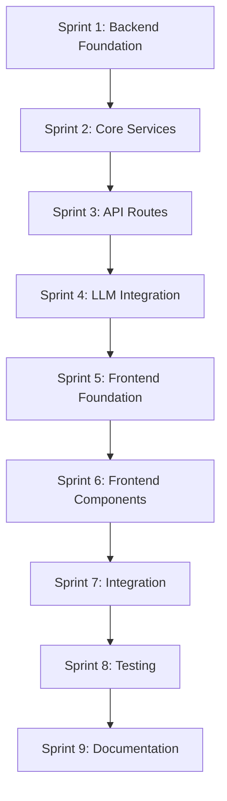

# Phase 22: AI Tutor Mode - Implementation Plan

## Overview

This document provides a detailed implementation plan for Phase 22: AI Tutor Mode. The architecture design is complete in [phase_22_ai_tutor_architecture.md](phase_22_ai_tutor_architecture.md). This plan breaks down the implementation into specific, actionable tasks.

---

## Sprint 1: Backend Foundation

### 1.1 Database Schema

**File**: `backend/app/core/schema.sql`

Add the following tables:

```sql
-- Tutor sessions table
CREATE TABLE IF NOT EXISTS tutor_sessions (
    id UUID PRIMARY KEY DEFAULT gen_random_uuid(),
    user_id UUID REFERENCES users(id) ON DELETE CASCADE,
    question_id UUID REFERENCES questions(id) ON DELETE CASCADE,
    session_id UUID REFERENCES sessions(id) ON DELETE SET NULL,
    started_at TIMESTAMP WITH TIME ZONE DEFAULT NOW(),
    ended_at TIMESTAMP WITH TIME ZONE,
    status VARCHAR(20) DEFAULT 'active',
    hint_count INTEGER DEFAULT 0,
    message_count INTEGER DEFAULT 0,
    learning_insights JSONB,
    created_at TIMESTAMP WITH TIME ZONE DEFAULT NOW()
);

-- Tutor messages table
CREATE TABLE IF NOT EXISTS tutor_messages (
    id UUID PRIMARY KEY DEFAULT gen_random_uuid(),
    session_id UUID REFERENCES tutor_sessions(id) ON DELETE CASCADE,
    role VARCHAR(10) NOT NULL,
    content TEXT NOT NULL,
    message_type VARCHAR(20) NOT NULL,
    metadata JSONB,
    created_at TIMESTAMP WITH TIME ZONE DEFAULT NOW()
);

-- Learning insights table
CREATE TABLE IF NOT EXISTS learning_insights (
    id UUID PRIMARY KEY DEFAULT gen_random_uuid(),
    user_id UUID REFERENCES users(id) ON DELETE CASCADE,
    insight_type VARCHAR(50) NOT NULL,
    topic VARCHAR(255),
    description TEXT NOT NULL,
    severity VARCHAR(20),
    first_identified TIMESTAMP WITH TIME ZONE DEFAULT NOW(),
    last_updated TIMESTAMP WITH TIME ZONE DEFAULT NOW(),
    occurrence_count INTEGER DEFAULT 1,
    resolved BOOLEAN DEFAULT FALSE
);

-- Hint usage tracking
CREATE TABLE IF NOT EXISTS hint_usage (
    id UUID PRIMARY KEY DEFAULT gen_random_uuid(),
    user_id UUID REFERENCES users(id) ON DELETE CASCADE,
    question_id UUID REFERENCES questions(id) ON DELETE CASCADE,
    session_id UUID REFERENCES tutor_sessions(id) ON DELETE CASCADE,
    hint_level INTEGER NOT NULL,
    requested_at TIMESTAMP WITH TIME ZONE DEFAULT NOW(),
    was_helpful BOOLEAN,
    time_to_answer INTEGER
);

-- Indexes for performance
CREATE INDEX idx_tutor_sessions_user ON tutor_sessions(user_id);
CREATE INDEX idx_tutor_sessions_question ON tutor_sessions(question_id);
CREATE INDEX idx_tutor_messages_session ON tutor_messages(session_id);
CREATE INDEX idx_learning_insights_user ON learning_insights(user_id);
CREATE INDEX idx_hint_usage_user ON hint_usage(user_id);
```

### 1.2 Pydantic Models

**File**: `backend/app/models/tutor.py`

Create the following models:
- `TutorSession` - Session state and metadata
- `TutorMessage` - Individual chat messages
- `Hint` - Multi-level hint structure
- `Explanation` - Personalized explanations
- `AnswerAnalysis` - Analysis of user answers
- `LearningInsight` - Tracked learning patterns
- `HintUsage` - Hint usage tracking
- Request/Response models for API

### 1.3 Tutor Repository

**File**: `backend/app/services/tutor_repository.py`

Implement data access layer:
- `create_session()` - Start new tutor session
- `get_session()` - Retrieve session by ID
- `update_session()` - Update session state
- `add_message()` - Add message to session
- `get_messages()` - Get session messages
- `save_insight()` - Store learning insight
- `get_user_insights()` - Get user's learning insights
- `track_hint_usage()` - Record hint request
- `get_hint_history()` - Get hint usage history

---

## Sprint 2: Core Services

### 2.1 Tutor Service

**File**: `backend/app/services/tutor_service.py`

Main orchestration service:
- `start_session()` - Initialize tutor session with context
- `get_hint()` - Generate appropriate hint level
- `ask_question()` - Process user question, generate response
- `explain_concept()` - Generate personalized explanation
- `analyze_answer()` - Analyze user's answer
- `end_session()` - Finalize session, generate summary

### 2.2 Hint Service

**File**: `backend/app/services/hint_service.py`

Adaptive hint generation:
- `generate_hint()` - Create hint at specified level
- `determine_hint_level()` - Calculate appropriate starting level
- `get_hint_history()` - Get previous hints for context
- `adapt_to_user()` - Adjust hints based on user profile

### 2.3 Socratic Service

**File**: `backend/app/services/socratic_service.py`

Socratic questioning engine:
- `generate_question()` - Create probing question
- `determine_question_type()` - Choose clarifying/probing/challenging/connecting
- `analyze_response()` - Evaluate user's response
- `generate_followup()` - Create follow-up question

### 2.4 Explanation Service

**File**: `backend/app/services/explanation_service.py`

Personalized explanations:
- `generate_explanation()` - Create tailored explanation
- `determine_difficulty()` - Assess appropriate detail level
- `find_related_questions()` - Find similar questions
- `generate_visual_aids()` - Create diagram references

### 2.5 Learning Analyzer

**File**: `backend/app/services/learning_analyzer.py`

User learning pattern analysis:
- `analyze_session()` - Extract insights from session
- `identify_misconceptions()` - Find common errors
- `identify_gaps()` - Find knowledge gaps
- `identify_strengths()` - Find strong areas
- `generate_recommendations()` - Create study recommendations

---

## Sprint 3: API Routes

### 3.1 Tutor API Routes

**File**: `backend/app/api/routes/tutor.py`

Implement endpoints:
- `POST /api/v1/tutor/sessions` - Start tutor session
- `GET /api/v1/tutor/sessions/{id}` - Get session state
- `POST /api/v1/tutor/sessions/{id}/hint` - Request hint
- `POST /api/v1/tutor/sessions/{id}/ask` - Ask question
- `POST /api/v1/tutor/sessions/{id}/explain` - Request explanation
- `POST /api/v1/tutor/sessions/{id}/analyze` - Analyze answer
- `POST /api/v1/tutor/sessions/{id}/end` - End session
- `GET /api/v1/tutor/history` - Get session history
- `GET /api/v1/tutor/insights` - Get learning insights

---

## Sprint 4: LLM Integration

### 4.1 Prompt Templates

**File**: `backend/app/services/tutor_prompts.py`

Create prompt templates:
- `TUTOR_PERSONA_PROMPT` - Base tutor persona
- `HINT_GENERATION_PROMPT` - Hint generation template
- `SOCRATIC_QUESTION_PROMPT` - Socratic questioning template
- `EXPLANATION_PROMPT` - Explanation generation template
- `ANSWER_ANALYSIS_PROMPT` - Answer analysis template

### 4.2 LLM Integration

Update `backend/app/services/llm_service.py`:
- Add tutor-specific generation methods
- Implement structured output parsing
- Add response validation
- Handle rate limiting

---

## Sprint 5: Frontend Foundation

### 5.1 TypeScript Types

**File**: `frontend/src/types/tutor.ts`

Create type definitions:
- `TutorSession` interface
- `TutorMessage` interface
- `Hint` interface
- `Explanation` interface
- `AnswerAnalysis` interface
- `LearningInsight` interface
- API request/response types

### 5.2 Tutor Service

**File**: `frontend/src/services/tutorService.ts`

API client methods:
- `startSession()` - Start new session
- `getSession()` - Get session state
- `requestHint()` - Request hint
- `askQuestion()` - Ask question
- `requestExplanation()` - Request explanation
- `analyzeAnswer()` - Analyze answer
- `endSession()` - End session
- `getHistory()` - Get history
- `getInsights()` - Get insights

### 5.3 Tutor Store

**File**: `frontend/src/stores/tutorStore.ts`

Zustand store:
- `activeSession` - Current session state
- `messages` - Message history
- `isLoading` - Loading state
- `hintLevel` - Current hint level
- `insights` - Learning insights
- Actions for all operations

---

## Sprint 6: Frontend Components

### 6.1 TutorPanel Component

**File**: `frontend/src/components/tutor/TutorPanel.tsx`

Main chat interface:
- Collapsible side panel
- Message list with auto-scroll
- Input area with send button
- Quick action buttons
- Typing indicator

### 6.2 TutorMessage Component

**File**: `frontend/src/components/tutor/TutorMessage.tsx`

Individual message display:
- Role-based styling (tutor vs user)
- Message type indicators
- Timestamp display
- Markdown rendering

### 6.3 HintButton Component

**File**: `frontend/src/components/tutor/HintButton.tsx`

Hint request interface:
- Level indicator (1-3)
- Progress indicator
- Disabled state when max hints reached
- Tooltip with hint info

### 6.4 TutorInput Component

**File**: `frontend/src/components/tutor/TutorInput.tsx`

User input interface:
- Text input with placeholder
- Send button
- Keyboard shortcuts
- Character limit indicator

### 6.5 ExplanationModal Component

**File**: `frontend/src/components/tutor/ExplanationModal.tsx`

Detailed explanation overlay:
- Modal with close button
- Difficulty selector
- Related questions links
- Visual aid placeholders

### 6.6 TutorInsights Component

**File**: `frontend/src/components/tutor/TutorInsights.tsx`

Learning insights display:
- Insight cards by type
- Severity indicators
- Resolution status
- Recommendations

---

## Sprint 7: Integration

### 7.1 Practice Session Integration

Update `frontend/src/pages/PracticeSession.tsx`:
- Add TutorPanel as collapsible sidebar
- Connect to current question
- Handle session lifecycle
- Update progress tracking

### 7.2 Dashboard Widget

Update `frontend/src/pages/Dashboard.tsx`:
- Add Learning Insights widget
- Show recent tutor sessions
- Display recommendations
- Quick access to tutor history

---

## Sprint 8: Testing

### 8.1 Backend Tests

**File**: `backend/tests/test_api/test_tutor.py`

API route tests:
- Session creation
- Hint generation
- Question handling
- Explanation generation
- Answer analysis
- Session completion

**File**: `backend/tests/test_services/test_tutor_service.py`

Service tests:
- TutorService methods
- HintService methods
- SocraticService methods
- ExplanationService methods
- LearningAnalyzer methods

### 8.2 Frontend Tests

**File**: `frontend/src/components/tutor/TutorPanel.test.tsx`

Component tests:
- TutorPanel rendering
- Message display
- Input handling
- Hint button behavior

**File**: `frontend/src/stores/tutorStore.test.ts`

Store tests:
- State management
- Actions
- API integration

### 8.3 E2E Tests

**File**: `frontend/e2e/tests/tutor-flow.spec.ts`

End-to-end tests:
- Start tutor session
- Request hints
- Ask questions
- View explanations
- End session

---

## Sprint 9: Documentation

### 9.1 API Documentation

Update `docs/API.md`:
- Add tutor endpoints
- Document request/response formats
- Add example requests

### 9.2 User Guide

Create `docs/TUTOR_GUIDE.md`:
- Feature overview
- How to use tutor
- Tips for effective learning
- FAQ

---

## Implementation Order



---

## File Structure

```
backend/
├── app/
│   ├── api/routes/
│   │   └── tutor.py              # NEW: Tutor API endpoints
│   ├── models/
│   │   └── tutor.py              # NEW: Tutor data models
│   ├── services/
│   │   ├── tutor_service.py      # NEW: Main tutor orchestration
│   │   ├── tutor_repository.py   # NEW: Data access layer
│   │   ├── hint_service.py       # NEW: Hint generation
│   │   ├── socratic_service.py   # NEW: Socratic questioning
│   │   ├── explanation_service.py # NEW: Explanations
│   │   ├── learning_analyzer.py  # NEW: Learning analysis
│   │   └── tutor_prompts.py      # NEW: LLM prompts
│   └── core/
│       └── schema.sql            # UPDATE: Add tutor tables

frontend/
├── src/
│   ├── components/tutor/
│   │   ├── TutorPanel.tsx        # NEW: Main chat interface
│   │   ├── TutorMessage.tsx      # NEW: Message component
│   │   ├── HintButton.tsx        # NEW: Hint request button
│   │   ├── TutorInput.tsx        # NEW: User input
│   │   ├── ExplanationModal.tsx  # NEW: Explanation overlay
│   │   ├── TutorInsights.tsx     # NEW: Insights display
│   │   └── index.ts              # NEW: Exports
│   ├── services/
│   │   └── tutorService.ts       # NEW: API client
│   ├── stores/
│   │   └── tutorStore.ts         # NEW: State management
│   ├── types/
│   │   └── tutor.ts              # NEW: TypeScript types
│   └── pages/
│       ├── PracticeSession.tsx   # UPDATE: Add tutor panel
│       └── Dashboard.tsx         # UPDATE: Add insights widget

docs/
├── API.md                        # UPDATE: Add tutor endpoints
└── TUTOR_GUIDE.md                # NEW: User guide
```

---

## Dependencies

- Existing LLM service (GLM-4)
- Knowledge graph service (FalkorDB)
- Session management
- User authentication
- Progress tracking

---

## Success Criteria

1. Users can start tutor sessions during practice
2. Hints are generated at appropriate levels
3. Socratic questions guide learning effectively
4. Explanations are personalized and helpful
5. Learning insights are tracked and displayed
6. All tests pass
7. Documentation is complete

---

*Phase 22 Implementation Plan v1.0*
