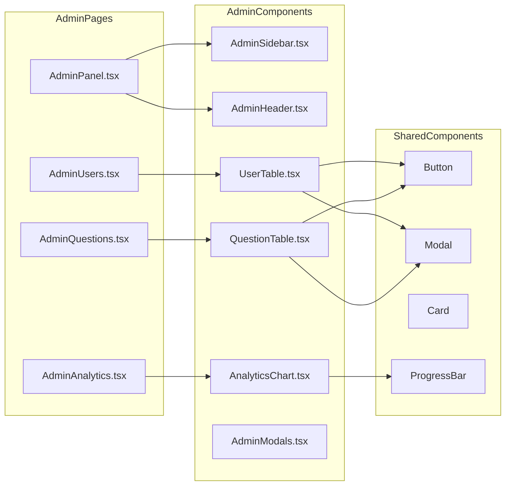

# Phase 24: Admin Dashboard

## Overview

Create a comprehensive admin dashboard for managing users, questions, and system analytics. This phase adds administrative capabilities to the GeneReason application, allowing administrators to monitor usage, manage content, and oversee user accounts.

## Goals

1. **User Management**: View, manage, and moderate user accounts
2. **Question Management**: Create, edit, delete, and moderate questions
3. **System Analytics**: Monitor platform usage, performance metrics, and trends
4. **Admin Security**: Role-based access control with audit logging

---

## Architecture

### System Flow

```mermaid
flowchart TD
    subgraph Frontend
        A[Admin Login] --> B{Role Check}
        B -->|Admin| C[Admin Dashboard]
        B -->|User| D[Access Denied]
        C --> E[User Management]
        C --> F[Question Management]
        C --> G[System Analytics]
        C --> H[Admin Settings]
    end
    
    subgraph Backend
        E --> I[/api/v1/admin/users]
        F --> J[/api/v1/admin/questions]
        G --> K[/api/v1/admin/analytics]
        H --> L[/api/v1/admin/settings]
    end
    
    subgraph Database
        I --> M[(users table)]
        J --> N[(questions table)]
        K --> O[(analytics_events)]
        K --> P[(daily_stats)]
        L --> Q[(admin_settings)]
    end
    
    style C fill:#4CAF50,stroke:#2E7D32,color:#fff
    style D fill:#f44336,stroke:#c62828,color:#fff
```

### Component Structure



---

## Database Schema Changes

### 1. Add Role Column to Users Table

The `UserRole` enum already exists in the code with `ADMIN`, `USER`, `GUEST` values. Need to add the role column to the database:

```sql
-- Add role column to users table
ALTER TABLE users ADD COLUMN IF NOT EXISTS role VARCHAR(20) DEFAULT 'user' 
    CHECK (role IN ('admin', 'user', 'guest'));

-- Create index for role queries
CREATE INDEX IF NOT EXISTS idx_users_role ON users(role);

-- Update existing users to have default role
UPDATE users SET role = 'user' WHERE role IS NULL;
```

### 2. Admin Audit Log Table

Track all admin actions for accountability:

```sql
-- Admin action audit log
CREATE TABLE IF NOT EXISTS admin_logs (
    id UUID PRIMARY KEY DEFAULT uuid_generate_v4(),
    admin_user_id UUID NOT NULL REFERENCES users(id) ON DELETE SET NULL,
    action VARCHAR(50) NOT NULL,           -- user_ban, question_delete, etc.
    target_type VARCHAR(50),                -- user, question, session
    target_id UUID,
    details JSONB DEFAULT '{}'::jsonb,      -- Additional context
    ip_address INET,
    user_agent TEXT,
    created_at TIMESTAMP WITH TIME ZONE DEFAULT NOW()
);

CREATE INDEX IF NOT EXISTS idx_admin_logs_admin ON admin_logs(admin_user_id);
CREATE INDEX IF NOT EXISTS idx_admin_logs_action ON admin_logs(action);
CREATE INDEX IF NOT EXISTS idx_admin_logs_target ON admin_logs(target_type, target_id);
CREATE INDEX IF NOT EXISTS idx_admin_logs_created ON admin_logs(created_at DESC);
```

### 3. Admin Settings Table

Store system-wide admin configuration:

```sql
-- System-wide admin settings
CREATE TABLE IF NOT EXISTS admin_settings (
    key VARCHAR(100) PRIMARY KEY,
    value JSONB NOT NULL,
    description TEXT,
    updated_by UUID REFERENCES users(id),
    updated_at TIMESTAMP WITH TIME ZONE DEFAULT NOW()
);

-- Insert default settings
INSERT INTO admin_settings (key, value, description) VALUES
    ('maintenance_mode', '{"enabled": false}', 'Enable maintenance mode'),
    ('registration_enabled', '{"enabled": true}', 'Allow new user registration'),
    ('max_questions_per_session', '{"value": 20}', 'Maximum questions per practice session'),
    ('rate_limit_requests', '{"value": 60}', 'Rate limit requests per minute')
ON CONFLICT (key) DO NOTHING;
```

### 4. Question Reports Table

Allow users to report problematic questions:

```sql
-- User reports for questions
CREATE TABLE IF NOT EXISTS question_reports (
    id UUID PRIMARY KEY DEFAULT uuid_generate_v4(),
    question_id UUID NOT NULL REFERENCES questions(id) ON DELETE CASCADE,
    reported_by UUID REFERENCES users(id) ON DELETE SET NULL,
    reason VARCHAR(50) NOT NULL,            -- incorrect, unclear, offensive, duplicate, other
    description TEXT,
    status VARCHAR(20) DEFAULT 'pending' CHECK (status IN ('pending', 'reviewed', 'resolved', 'dismissed')),
    reviewed_by UUID REFERENCES users(id),
    reviewed_at TIMESTAMP WITH TIME ZONE,
    resolution_note TEXT,
    created_at TIMESTAMP WITH TIME ZONE DEFAULT NOW()
);

CREATE INDEX IF NOT EXISTS idx_question_reports_question ON question_reports(question_id);
CREATE INDEX IF NOT EXISTS idx_question_reports_status ON question_reports(status);
CREATE INDEX IF NOT EXISTS idx_question_reports_created ON question_reports(created_at DESC);
```

---

## Backend API Endpoints

### Admin Routes: `/api/v1/admin/*`

All admin endpoints require:
- Valid JWT token
- User role = `admin`

#### User Management

| Method | Endpoint | Description |
|--------|----------|-------------|
| GET | `/admin/users` | List all users with pagination and filters |
| GET | `/admin/users/{id}` | Get user details with activity summary |
| PUT | `/admin/users/{id}` | Update user role or status |
| DELETE | `/admin/users/{id}` | Soft delete/deactivate user |
| POST | `/admin/users/{id}/reset-password` | Force password reset |

#### Question Management

| Method | Endpoint | Description |
|--------|----------|-------------|
| GET | `/admin/questions` | List all questions with filters |
| GET | `/admin/questions/{id}` | Get question with metadata |
| POST | `/admin/questions` | Create new question |
| PUT | `/admin/questions/{id}` | Update question |
| DELETE | `/admin/questions/{id}` | Delete question |
| GET | `/admin/questions/reports` | List reported questions |
| PUT | `/admin/questions/reports/{id}` | Resolve report |

#### Analytics

| Method | Endpoint | Description |
|--------|----------|-------------|
| GET | `/admin/analytics/overview` | System-wide statistics |
| GET | `/admin/analytics/users` | User growth and activity |
| GET | `/admin/analytics/questions` | Question performance stats |
| GET | `/admin/analytics/sessions` | Session completion rates |
| GET | `/admin/analytics/performance` | System performance metrics |

#### System Management

| Method | Endpoint | Description |
|--------|----------|-------------|
| GET | `/admin/settings` | Get all admin settings |
| PUT | `/admin/settings/{key}` | Update setting |
| GET | `/admin/logs` | Get admin action logs |
| GET | `/admin/health` | System health check |

---

## Frontend Components

### Pages

#### 1. AdminPanel.tsx
Main admin dashboard with:
- Overview statistics cards
- Quick action buttons
- Recent activity feed
- System alerts

#### 2. AdminUsers.tsx
User management page with:
- Sortable/filterable user table
- User detail modal
- Role assignment
- Account status management
- Activity history view

#### 3. AdminQuestions.tsx
Question management page with:
- Question table with filters
- Question editor modal
- Bulk import/export
- Report queue
- Statistics per question

#### 4. AdminAnalytics.tsx
Analytics dashboard with:
- Usage charts
- Performance graphs
- Export functionality
- Date range filters

### Components

#### AdminSidebar.tsx
- Navigation menu
- Quick stats summary
- Admin profile

#### AdminHeader.tsx
- Breadcrumb navigation
- Search functionality
- Notifications

#### UserTable.tsx
- Paginated table
- Sort columns
- Filter by role/status
- Action buttons

#### QuestionTable.tsx
- Question preview
- Filter by category/difficulty
- Status indicators
- Quick actions

#### AnalyticsChart.tsx
- Reusable chart component
- Multiple chart types
- Responsive design

#### AdminModals.tsx
- ConfirmDialog
- UserEditModal
- QuestionEditModal
- ReportResolutionModal

---

## Implementation Tasks

### Backend Tasks

#### 1. Database Schema Updates
- [ ] Add role column to users table
- [ ] Create admin_logs table
- [ ] Create admin_settings table
- [ ] Create question_reports table
- [ ] Add RLS policies for admin tables
- [ ] Create migration script

#### 2. Admin Models
- [ ] Create AdminLog Pydantic model
- [ ] Create AdminSettings models
- [ ] Create QuestionReport models
- [ ] Create AdminAnalytics response models
- [ ] Create admin request/response schemas

#### 3. Admin Repository
- [ ] Create admin_repository.py
- [ ] Implement user management queries
- [ ] Implement admin log queries
- [ ] Implement settings queries
- [ ] Implement analytics queries

#### 4. Admin Service
- [ ] Create admin_service.py
- [ ] Implement user management logic
- [ ] Implement question management logic
- [ ] Implement analytics aggregation
- [ ] Implement settings management

#### 5. Admin API Routes
- [ ] Create admin.py routes file
- [ ] Implement user endpoints
- [ ] Implement question endpoints
- [ ] Implement analytics endpoints
- [ ] Implement settings endpoints
- [ ] Add admin-only middleware/decorator

#### 6. Admin Authorization
- [ ] Create require_admin dependency
- [ ] Add role checking to JWT validation
- [ ] Implement audit logging decorator
- [ ] Add IP tracking for admin actions

### Frontend Tasks

#### 1. Admin Types
- [ ] Create admin types in types/admin.ts
- [ ] Define UserAdmin, QuestionAdmin interfaces
- [ ] Define Analytics interfaces
- [ ] Define API response types

#### 2. Admin Service
- [ ] Create adminService.ts
- [ ] Implement user management API calls
- [ ] Implement question management API calls
- [ ] Implement analytics API calls
- [ ] Implement settings API calls

#### 3. Admin Store
- [ ] Create adminStore.ts with Zustand
- [ ] State for users, questions, analytics
- [ ] Actions for CRUD operations
- [ ] Filter and pagination state

#### 4. Admin Pages
- [ ] Create AdminPanel.tsx
- [ ] Create AdminUsers.tsx
- [ ] Create AdminQuestions.tsx
- [ ] Create AdminAnalytics.tsx
- [ ] Add routes to App.tsx

#### 5. Admin Components
- [ ] Create AdminSidebar.tsx
- [ ] Create AdminHeader.tsx
- [ ] Create UserTable.tsx
- [ ] Create QuestionTable.tsx
- [ ] Create AnalyticsChart.tsx
- [ ] Create AdminModals.tsx

#### 6. Admin Guards
- [ ] Create AdminRoute component
- [ ] Check user role before rendering
- [ ] Redirect non-admins
- [ ] Show access denied message

### Testing Tasks

#### Backend Tests
- [ ] Test admin authorization middleware
- [ ] Test user management endpoints
- [ ] Test question management endpoints
- [ ] Test analytics endpoints
- [ ] Test settings endpoints
- [ ] Test audit logging

#### Frontend Tests
- [ ] Test admin route protection
- [ ] Test admin components
- [ ] Test admin store actions
- [ ] Test admin service calls

#### E2E Tests
- [ ] Test admin login flow
- [ ] Test user management flow
- [ ] Test question management flow
- [ ] Test analytics viewing

---

## Security Considerations

1. **Role-Based Access Control**
   - All admin endpoints verify `role == 'admin'`
   - JWT tokens include role claim
   - Role changes require re-authentication

2. **Audit Logging**
   - All admin actions logged with timestamp, IP, user agent
   - Logs cannot be deleted by admins
   - Logs retained for compliance

3. **Rate Limiting**
   - Stricter rate limits for admin endpoints
   - Prevent abuse of admin privileges

4. **Input Validation**
   - All inputs validated with Pydantic
   - SQL injection prevention via parameterized queries
   - XSS prevention via output encoding

5. **Sensitive Data**
   - Passwords never returned in API responses
   - PII handled according to privacy requirements
   - Option to export/anonymize user data

---

## UI/UX Design

### Admin Dashboard Layout

```
┌─────────────────────────────────────────────────────────────────┐
│  Admin Header                                     [Search] [🔔] │
├──────────────┬──────────────────────────────────────────────────┤
│              │                                                   │
│  Sidebar     │   Main Content Area                              │
│              │                                                   │
│  Dashboard   │   ┌─────────┐ ┌─────────┐ ┌─────────┐ ┌───────┐ │
│  Users       │   │ Users   │ │Sessions │ │Questions│ │Reports│ │
│  Questions   │   │   142   │ │  1,234  │ │   89    │ │   5   │ │
│  Analytics   │   └─────────┘ └─────────┘ └─────────┘ └───────┘ │
│  Settings    │                                                   │
│              │   Recent Activity                                │
│  ──────────  │   ┌─────────────────────────────────────────────┐│
│  Reports     │   │ • User john@example.com registered          ││
│  Logs        │   │ • Question #45 reported as incorrect        ││
│              │   │ • Admin updated system settings             ││
│              │   └─────────────────────────────────────────────┘│
│              │                                                   │
└──────────────┴──────────────────────────────────────────────────┘
```

### User Management Table

```
┌──────────────────────────────────────────────────────────────────────────┐
│ Users                                              [Filter] [+ Add User] │
├──────────────────────────────────────────────────────────────────────────┤
│ [ ] Email          │ Role    │ Status  │ Joined    │ Last Active │ Actions│
├──────────────────────────────────────────────────────────────────────────┤
│ [ ] john@test.com  │ user    │ active  │ 2024-01-15│ 2 hours ago │ ⋮      │
│ [ ] admin@test.com │ admin   │ active  │ 2024-01-01│ 5 mins ago  │ ⋮      │
│ [ ] jane@test.com  │ user    │ inactive│ 2024-01-20│ 3 days ago  │ ⋮      │
└──────────────────────────────────────────────────────────────────────────┘
                                    ◀ 1 2 3 ... 10 ▶
```

---

## Success Metrics

1. **Functionality**
   - Admins can manage all users
   - Admins can manage all questions
   - Analytics provide actionable insights
   - All actions are logged

2. **Performance**
   - Admin pages load in < 2 seconds
   - Tables support 1000+ rows efficiently
   - Analytics queries complete in < 5 seconds

3. **Security**
   - No unauthorized access to admin features
   - All admin actions traceable
   - No data leaks

---

## Dependencies

- Existing auth system with JWT tokens
- Existing database schema
- Existing component library (Button, Modal, Card, etc.)
- Chart library (recommend recharts or chart.js)

---

## Timeline Estimate

This phase involves significant backend and frontend work. The implementation is broken into clear tasks that can be executed in Code mode.

---

*Phase 24 Plan v1.0 - Admin Dashboard for GeneReason*
